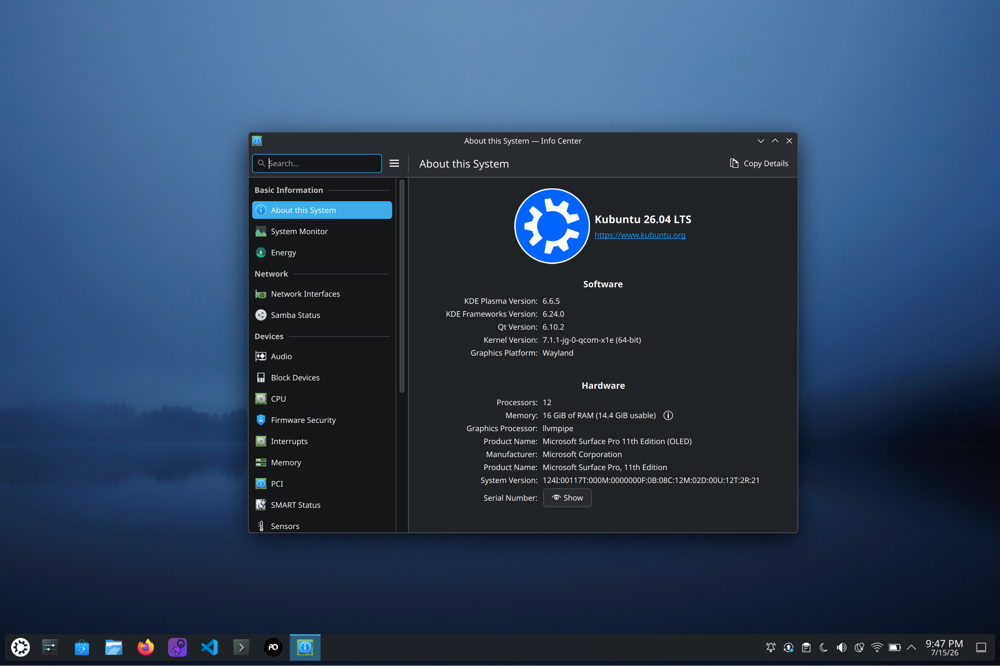

# Ubuntu on Surface Pro 11 (Snapdragon X Elite)



This repository is an experimental Ubuntu bring-up kit for the Microsoft
Surface Pro 11 with Snapdragon X Elite (X1E80100). It uses the Surface Laptop
7 Ubuntu work as a reference, and ports the Surface Pro 11-specific pieces from
Dale Whinham’s Arch Linux work and, most importantly, [Jens Glathe](https://github.com/jglathe)'s continual kernel work: [join the community](https://discourse.ubuntu.com/t/ubuntu-concept-snapdragon-x-elite/48800/2027).

The current verified target is:

| Item | Value |
| --- | --- |
| Device | Microsoft Surface Pro, 11th Edition |
| SKU | `Surface_Pro_11th_Edition_2076` |
| CPU | `Snapdragon(R) X 12-core X1E80100 @ 3.40 GHz` |
| Firmware/UEFI | `175.222.235`, dated 2026-02-23 |
| Internal disk | Samsung `MZ9L4512HBLU-00BMV-SAMSUNG`, 476.9 GiB NVMe |
| Windows source checked | Windows 11 Home Insider Preview build `29585` |

> Warning: this is not an official Ubuntu, Microsoft, or linux-surface release.
> Keep Windows installed, keep a recovery USB nearby, and expect regressions.

## Prerequisites

- Surface Pro 11 with Snapdragon X Elite (`X1E80100`) — not Surface Laptop 7/Romulus or Intel Surface devices
- Windows backup + BitLocker/Device Encryption recovery key (suspend or decrypt before partition work)
- Secure Boot disabled in Surface UEFI
- Windows recovery USB or another restore path
- USB-C flash drive, 16 GB+ (write script erases the entire disk)
- macOS build host with Docker Desktop, `git`, `diskutil`, sudo (20 GB free)
- Temporary networking for post-install firmware (Wi-Fi doesn't work in the live session — use USB-C Ethernet, phone tethering, or a mounted Windows partition)
- External USB keyboard recommended for installer recovery

## Current Status

The Surface Pro 11 needs a custom device tree and firmware handling — a stock
ARM64 Ubuntu ISO is not enough. See the
[dwhinham/linux-surface-pro-11 "What's working"](https://github.com/dwhinham/linux-surface-pro-11#whats-working)
list for the upstream Arch status.

| Feature | Status | Notes |
| --- | --- | --- |
| NVMe | ✅ Working | Installed Ubuntu boots from `/dev/nvme0n1p5` with separate `/boot` and `/boot/efi` partitions after support setup. |
| Graphics | ✅ Working | Direct boot reaches the Ubuntu desktop. 3D acceleration for X1E SoCs only; X1P support is on its way from upstream. |
| Backlight | ✅ Working | Night Light and screen brightness controls work. Adjustable via `/sys/class/backlight/dp_aux_backlight/brightness`. |
| USB3 | ⚠️ Partially | USB-C ports are working, but the Surface Dock connector is presumably not. |
| USB4/Thunderbolt | ❌ Not working | No external display output when using the [official USB4 dock](https://learn.microsoft.com/en-us/surface/surface-usb4-dock). |
| USB-C display output | ✅ Working | Working as of 6.15-rc6 (for DP alt mode). |
| USB-C boot | ✅ Working with `--grub-mode direct` | The normal GRUB menu can display entries but input and timeout are unreliable. Use `--grub-mode direct` for the verified live-USB path. |
| Wi-Fi | ✅ Working | WCN7850/Qualcomm FastConnect 7800 binds to `ath12k_wifi7_pci`, loads firmware, scans, reconnects to a saved network after reboot, and passes traffic on patched git-fallback `7.0.0-22-qcom-x1e` plus an rfkill-capable Denali DTB. Stock/upgraded `7.0.0-32-qcom-x1e` remained hard-blocked. Uses a [kernel hack to disable rfkill](https://github.com/dwhinham/kernel-surface-pro-11/commit/fcc769be9eaa9823d55e98a28402104621fa6784). Continue validating normal reboots, suspend/resume, and package upgrades. |
| Bluetooth | ✅ Working | Public address set via raw `AF_BLUETOOTH` socket C helper (`tools/sp11-bt-set-addr.c`) before `bluetooth.service` starts, avoiding the btmgmt D-state hang. Cold boot service succeeds at T+1s. Pairing, audio, and suspend/resume still need validation. See [how-to-bring-up-bluetooth](docs/how-to/how-to-bring-up-bluetooth.md). |
| Audio — speakers | ⚠️ Partially | Sound card instantiates with generated topology from the CRD template. Both stereo speaker endpoints produce audio through a PipeWire manual sink with reordered `audio.position` labels. The 4-channel PCM is a transport layout, not four independently routable speakers. Music playback showed no audible regression with the 2.4 MHz DMIC kernel, but the manual sink is still required and speakers can sound distorted. See [`how-to-bring-up-audio`](docs/how-to/how-to-bring-up-audio.md) and [ADR-0036](docs/adr/adr-0036-right-speaker-audio-position-reorder.md). |
| Audio — microphone | ✅ Working with 2.4 MHz DMIC clock | The corrected single-WSA-macro UCM profile exposes two-channel internal microphone capture, and Surface-specific unity gain avoids the shared +16 dB default clipping. Setting the Denali DMIC clock to 2.4 MHz eliminates the continuous feedback/static heard at 4.8 MHz and makes recorded speech dramatically clearer. Capture remains slightly tinny or thin. See [ADR-0044](docs/adr/adr-0044-sp11-ucm-single-wsa-macro-microphone.md) and [ADR-0046](docs/adr/adr-0046-sp11-default-2p4mhz-dmic-clock.md). |
| Touchscreen | ❌ Not working | Kernel patches and DTB build and compile, but the kernel uses the EFI firmware DTB (Stubble) which has `spi@a88000` as `disabled`, ignoring GRUB's `devicetree` directive. Requires a kernel rebuild with `CONFIG_EFI_ARMSTUB_DTB_LOADER=y` and `dtb=` cmdline — rebuild hangs at boot. See [ADR-0041](docs/adr/adr-0041-sp11-touchscreen-patches.md) for patch set structure, [ADR-0042](docs/adr/adr-0042-sp11-touchscreen-troubleshooting.md) for the full troubleshooting history, diagnostics, and remaining options. |
| Pen | ❌ Not working | Not working in live USB. Upstream Arch notes also list pen as not working. |
| Touchpad | ✅ Working | Type Cover touchpad works after the kernel loads `i2c-hid-of` and the `gpio` keys. Hot-plug may need re-binding. |
| Suspend/Resume | ⚠️ Partially | Lid suspend works with kernel `6.10+`, but can fail to resume display. |

## Quick Start

The custom live-USB builder creates a small ARM64 GRUB boot shim, stores the
Ubuntu Snapdragon X concept ISO on a Linux data partition, and injects the
Surface Pro 11 device tree at boot. This avoids remastering the Ubuntu ISO.

### 1. Build the patched kernel (Docker, on macOS)

```bash
cd /path/to/linux-surface-pro-11-oe
mkdir -p build

# Default: Ubuntu concept kernel
./scripts/build-sp11-qcom-x1e-kernel-docker.sh \
  --source git --work-dir build/docker-sp11-qcom-x1e-kernel \
  --copy-to-payload --reset-source --jobs 4

# OR: Johan G.'s 7.1.3 tree with the validated 2.4 MHz SP11 DMIC clock
./scripts/build-sp11-qcom-x1e-kernel-docker.sh \
  --source git \
  --git-url https://github.com/jglathe/linux_ms_dev_kit.git \
  --git-branch jg/ubuntu-qcom-x1e-7.1.3-jg-1 \
  --image ubuntu:26.04 \
  --patch-dirs "patches/jglathe-qcom-x1e-7.1.3 patches/sp11-dmic-2p4mhz" \
  --build-target "binary-indep binary-qcom-x1e" \
  --work-dir build/docker-sp11-qcom-x1e-kernel-jg-7.1.3-sp11 \
  --linux-work-volume sp11-qcom-x1e-kernel-build-jg-7.1.3-sp11 \
  --copy-to-payload \
  --reset-source \
  --jobs 4
```

`--patch-dirs` accepts a space-separated list; patches from each directory are
applied in order. The `binary-indep` target is required because the ABI-specific
headers package depends on `linux-qcom-x1e-headers-<abi>` (e.g.
`linux-qcom-x1e-headers-7.1.3-jg-1`).

If a new `jg/ubuntu-qcom-x1e-7.1.3-jg-<n>` tag fails `check-config` with
`N config options have been changed`, regenerate the annotations patch before
rerunning the build:

```bash
./scripts/regenerate-qcom-x1e-annotations.sh \
  --git-url https://github.com/jglathe/linux_ms_dev_kit.git \
  --git-branch "jg/ubuntu-qcom-x1e-7.1.3-jg-<n>" \
  --reset-source
```

The helper installs the source package's complete build dependencies, uses the
same compiler and Rust probes as the package build, removes the stale
annotations patch for the previous tag, and writes the replacement into
`patches/jglathe-qcom-x1e-7.1.3/`. Verify the new filename, then rerun the
original build command unchanged.

See the [patched qcom-x1e kernel how-to](docs/how-to/how-to-build-patched-qcom-x1e-kernel.md)
for the full on-device build path and fallback-kernel safety model.

### 2. Build the USB image

```bash
./scripts/build-sp11-live-usb-image.sh \
  --iso https://people.canonical.com/~platform/images/ubuntu-concept/resolute-desktop-arm64+x1e.iso \
  --grub-mode direct \
  --work-dir build/work-direct-boot \
  --out build/sp11-ubuntu-live-direct.img \
  --validate
```

If auto DTB extraction fails, provide one explicitly via `--dtb`. An explicit
DTB can come from a kernel package with SP11 support or from a local build of
`dwhinham/kernel-surface-pro-11`. Do not substitute the Surface Laptop 7/Romulus DTB.

To build a live USB with KDE Plasma available by default, add `--desktop kde`.
See [ADR-0039](docs/adr/adr-0039-kde-plasma-desktop-option.md).

### 3. Write the USB

```bash
diskutil list
diskutil info /dev/diskX  # verify it's the removable USB disk
./scripts/write-image-to-macos-disk.sh build/sp11-ubuntu-live-direct.img /dev/diskX
```

The script refuses to write unless the disk is external, removable, and USB.

### 4. Boot and install

1. Disable Secure Boot in Surface UEFI.
2. Boot from the USB.
3. Install Ubuntu carefully (shrink Windows, create `/`, `/boot`, `/boot/efi`).
4. At the end of the installer, choose **continue testing** and run the
   installed-system preparer before rebooting:

```bash
SP11DEV="$(blkid -L SP11DATA)"
SP11DATA="$(findmnt -rn -S "$SP11DEV" -o TARGET | head -n 1)"
[ -z "$SP11DATA" ] && { sudo mkdir -p /mnt/sp11data; sudo mount "$SP11DEV" /mnt/sp11data; SP11DATA=/mnt/sp11data; }
cd "$SP11DATA/support"
sudo ./scripts/prepare-sp11-installed-system.sh --target /target
sudo reboot
```

### 5. Post-install: firmware + kernel + bring-up

After the first installed boot, mount `SP11DATA` and run the finish script
(downloads firmware, installs support helpers, reboots):

```bash
SP11DEV="$(blkid -L SP11DATA)"
SP11DATA="$(findmnt -rn -S "$SP11DEV" -o TARGET | head -n 1)"
[ -z "$SP11DATA" ] && { sudo mkdir -p /mnt/sp11data; sudo mount "$SP11DEV" /mnt/sp11data; SP11DATA=/mnt/sp11data; }
cd "$SP11DATA/support"
sudo ./scripts/finish-sp11-installed-system.sh --download --reboot
```

If networking is unavailable, mount the Windows partition and use Windows
firmware instead: `--windows-root "$WINROOT"` (see the script `--help`).

Then install the patched kernel payload from the USB:

```bash
cd "$SP11DATA/support"
./scripts/build-sp11-qcom-x1e-kernel.sh --work-dir "$SP11DATA/payload/kernel-debs" --install-only
sudo reboot
```

Keep the previous qcom-x1e kernel as a GRUB fallback until the patched kernel
has booted and Wi-Fi rfkill state has been validated.

For a direct local installation instead of the USB payload flow, place all
four matching `.deb` packages in one directory and run the same helper against
that directory. For example, with the 2.4 MHz DMIC packages downloaded to
`$HOME/Downloads`:

```bash
cd /path/to/linux-surface-pro-11-oe
./scripts/build-sp11-qcom-x1e-kernel.sh \
  --work-dir "$HOME/Downloads" \
  --install-only
sudo reboot
```

For the validated build, the directory must contain the matching image,
modules, flavour-header, and common-header packages for
`7.1.3-jg-1dmic2p4`. After reboot, verify the running kernel and authoritative
Stubble-provided DMIC clock:

```bash
uname -r
od -An -tu4 -N4 --endian=big \
  /sys/firmware/devicetree/base/soc@0/codec@6d44000/qcom,dmic-sample-rate
```

Expected values are `7.1.3-jg-1dmic2p4-qcom-x1e` and `2400000`.

## Post-Install Bring-Up

### Wi-Fi

The WCN7850 needs a patched kernel with rfkill disabled. The `board.bin`
fallback is enough for the adapter to probe; the remaining blocker is the
rfkill kernel/DTB path. See the
[patched qcom-x1e kernel how-to](docs/how-to/how-to-build-patched-qcom-x1e-kernel.md)
for the full diagnostic and build path.

### Bluetooth

```bash
cd "$SP11DATA/support"
sudo ./scripts/troubleshoot-sp11-bluetooth.sh
```

If the diagnostic reports a `00:00:00:00:*` address, get the real Bluetooth MAC
from Windows (see [how-to-bring-up-bluetooth](docs/how-to/how-to-bring-up-bluetooth.md))
and configure it:

```bash
BT_MAC="<your-bluetooth-mac>"
sudo ./scripts/sp11-bluetooth-mac.sh --write-config "$BT_MAC"
gcc -Wall -Wextra -O2 -o tools/sp11-bt-set-addr tools/sp11-bt-set-addr.c
sudo ./scripts/sp11-bluetooth-mac.sh --install-systemd
sudo udevadm trigger --subsystem-match=bluetooth
sudo reboot
```

The installed unit runs before `bluetooth.service`, avoiding the cold-boot
D-state hang. See [ADR-0032](docs/adr/adr-0032-raw-mgmt-socket-bluetooth-cold-boot.md).

### Audio

```bash
cd "$SP11DATA/support"
sudo ./scripts/troubleshoot-sp11-audio.sh
```

If the topology file is missing, build and install it:

```bash
cd "$SP11DATA/support"
./scripts/sp11-audio-topology.sh
sudo ./scripts/sp11-audio-topology.sh --install
sudo ./scripts/sp11-fix-audio-boot-race.sh install
sudo reboot
```

Alternatively, download the
[prebuilt audio topology release](https://github.com/ooaklee/linux-surface-pro-11-oe/releases/tag/sp11-audio-topology-v1).

See [`how-to-bring-up-audio`](docs/how-to/how-to-bring-up-audio.md) and
[ADR-0035](docs/adr/adr-0035-audio-boot-race-alsactl.md) for details.

## KDE Plasma (Kubuntu-like Experience)

Kubuntu has no official ARM64 ISO. Two paths to a KDE Plasma desktop:

**Option 1 (recommended): Post-install swap**

```bash
cd "$SP11DATA/support"
sudo ./scripts/sp11-install-kde-desktop.sh
# Once confirmed, optionally remove GNOME:
sudo ./scripts/sp11-install-kde-desktop.sh --purge-gnome -y
```

**Option 2 (experimental): Live USB with KDE**

```bash
./scripts/build-sp11-live-usb-image.sh \
  --iso https://people.canonical.com/~platform/images/ubuntu-concept/resolute-desktop-arm64+x1e.iso \
  --desktop kde --grub-mode direct \
  --out build/sp11-ubuntu-live-direct-kde.img --validate
```

Both paths are desktop-layer changes only — they do not touch the SP11 kernel,
DTB, firmware, audio, or Bluetooth bring-up. See
[ADR-0039](docs/adr/adr-0039-kde-plasma-desktop-option.md).

## Test Notes

- [2026-06-13 direct live USB test](docs/live-usb-test-20260613.md)
- [2026-06-13 installed NVMe boot test](docs/installed-nvme-boot-test-20260613.md)
- [2026-06-13 installed Wi-Fi rfkill test](docs/installed-wifi-rfkill-test-20260613.md)
- [2026-06-13 Wi-Fi rfkill test after qcom-x1e upgrade](docs/installed-wifi-rfkill-upgrade-test-20260613.md)
- [2026-06-13 Wi-Fi test after Windows firmware and cold boot](docs/installed-wifi-windows-firmware-cold-boot-test-20260613.md)
- [2026-06-14 Wi-Fi rfkill test after patched qcom-x1e boot](docs/installed-wifi-patched-rfkill-test-20260614.md)
- [2026-06-14 Wi-Fi clean USB flow test](docs/installed-wifi-clean-usb-flow-test-20260614.md)
- [2026-06-14 Bluetooth public address test](docs/installed-bluetooth-public-address-test-20260614.md)

### Visual Evidence

- [Wi-Fi networks visible in GNOME](assets/wifi/2026-06-14-sp11-wifi-networks-redacted.png)
- [Browser speed test after Wi-Fi connection](assets/wifi/2026-06-14-sp11-speedtest-redacted.webp)
- [Bluetooth settings with a paired speaker](assets/bluetooth/2026-06-14-sp11-bluetooth-search-connect-redacted.png)

## How-To Guides

- [Build a Patched qcom-x1e Kernel](docs/how-to/how-to-build-patched-qcom-x1e-kernel.md)
- [Bring Up Bluetooth](docs/how-to/how-to-bring-up-bluetooth.md)
- [Bring Up Audio](docs/how-to/how-to-bring-up-audio.md)
- [Compile the Raw mgmt-Socket Bluetooth Helper](docs/how-to/how-to-compile-sp11-bt-set-addr.md)
- [Release Prebuilt Kernel Artifacts](docs/how-to/how-to-release-kernel-artifacts.md)
- [Release Audio Topology Artifacts](scripts/prepare-sp11-audio-release-assets.sh)
- [Generate a Service Report](docs/how-to/how-to-generate-service-report.md)
- [Troubleshoot Docker Overlay Mount Failures on Linux Build Hosts](docs/how-to/how-to-troubleshoot-linux-docker-overlay.md)
- [Troubleshoot Docker `exec format error` on x86_64 Linux Build Hosts](docs/how-to/how-to-troubleshoot-docker-exec-format-error.md)
- [Troubleshoot Kernel Git Clone `fetch-pack` Failures](docs/how-to/how-to-troubleshoot-kernel-git-clone-failures.md)

## Decision Records

The major bring-up decisions are recorded in `docs/adr/`:

- [ADR001: Target Repo and Scope](docs/adr/adr-0001-target-repo-and-scope.md)
- [ADR002: Boot Shim Image Strategy](docs/adr/adr-0002-boot-shim-image-strategy.md)
- [ADR003: Denali DTB and GRUB Injection](docs/adr/adr-0003-denali-dtb-and-grub-injection.md)
- [ADR004: Firmware Extraction Policy](docs/adr/adr-0004-firmware-extraction-policy.md)
- [ADR005: Wi-Fi Board Fixup](docs/adr/adr-0005-wifi-board-fixup.md)
- [ADR006: Build and Write Guardrails](docs/adr/adr-0006-build-and-write-guardrails.md)
- [ADR007: Auto DTB Extraction and Debug Entries](docs/adr/adr-0007-auto-dtb-extraction-and-debug-entries.md)
- [ADR008: Ubuntu Denali DTB Variants](docs/adr/adr-0008-ubuntu-denali-dtb-variants.md)
- [ADR009: Default Casper ISO Scan Boot](docs/adr/adr-0009-default-casper-iso-scan-boot.md)
- [ADR010: Image Validation Workflow](docs/adr/adr-0010-image-validation-workflow.md)
- [ADR011: GRUB EFI Console Input](docs/adr/adr-0011-grub-efi-console-input.md)
- [ADR012: GRUB Module Tree](docs/adr/adr-0012-grub-module-tree.md)
- [ADR013: Standalone GRUB External Keyboard Test](docs/adr/adr-0013-standalone-grub-external-keyboard-test.md)
- [ADR014: Direct GRUB Autoboot Diagnostic](docs/adr/adr-0014-direct-grub-autoboot-diagnostic.md)
- [ADR015: Direct Live Desktop and Install Gate](docs/adr/adr-0015-direct-live-desktop-and-install-gate.md)
- [ADR016: USB Data Mount and Installed-System Helpers](docs/adr/adr-0016-usb-data-mount-and-installed-system-helpers.md)
- [ADR017: GRUB DTB Path for Separate Boot](docs/adr/adr-0017-grub-dtb-path-for-separate-boot.md)
- [ADR018: Wi-Fi rfkill Bring-Up Gate](docs/adr/adr-0018-wifi-rfkill-bring-up-gate.md)
- [ADR019: Patched qcom-x1e Kernel for Wi-Fi rfkill](docs/adr/adr-0019-patched-qcom-x1e-kernel-for-wifi-rfkill.md)
- [ADR020: Dockerized ARM64 Kernel Build](docs/adr/adr-0020-dockerized-arm64-kernel-build.md)
- [ADR021: Git Fallback Kernel Build Toolchain](docs/adr/adr-0021-git-fallback-kernel-build-toolchain.md)
- [ADR022: Docker Kernel Build Without fakeroot](docs/adr/adr-0022-docker-kernel-build-without-fakeroot.md)
- [ADR023: Docker Kernel Build Case-Sensitive Work Volume](docs/adr/adr-0023-docker-kernel-build-case-sensitive-work-volume.md)
- [ADR024: Bluetooth, Audio, and Board-Data Bring-Up Gates](docs/adr/adr-0024-bluetooth-audio-and-board-data-gates.md)
- [ADR025: rfkill-Capable DTB Selection](docs/adr/adr-0025-rfkill-capable-dtb-selection.md)
- [ADR026: Prebuilt Kernel Release Artifacts](docs/adr/adr-0026-prebuilt-kernel-release-artifacts.md)
- [ADR027: Bluetooth Public Address](docs/adr/adr-0027-bluetooth-public-address.md)
- [ADR028: Bounded Bluetooth Management Hook](docs/adr/adr-0028-bounded-bluetooth-management-hook.md)
- [ADR029: Bluetooth Cold-Boot Service Retry Profile](docs/adr/adr-0029-bluetooth-cold-boot-service-retry-profile.md)
- [ADR030: Bluetooth btmgmt Batch Sequence](docs/adr/adr-0030-bluetooth-btmgmt-batch-sequence.md)
- [ADR031: Bluetooth Indexed Public Address and No Pre-Apply Restart](docs/adr/adr-0031-bluetooth-indexed-public-address.md)
- [ADR032: Raw mgmt-Socket Bluetooth Cold-Boot Solution](docs/adr/adr-0032-raw-mgmt-socket-bluetooth-cold-boot.md)
- [ADR0033: Surface Pro 11 Audio Topology Gap](docs/adr/adr-0033-audio-topology-gap.md)
- [ADR0034: Right Speaker Silence — SoundWire Port Mapping and Regmap Cache](docs/adr/adr-0034-wsa2-regcache-right-speaker.md)
- [ADR0035: Audio Boot Race — alsactl Restore vs AudioReach DSP Graph Load](docs/adr/adr-0035-audio-boot-race-alsactl.md)
- [ADR0036: Right Speaker Audio via PipeWire audio.position Reorder](docs/adr/adr-0036-right-speaker-audio-position-reorder.md)
- [ADR0037: Packaged Stubble Paths for Johan G. qcom-x1e 7.1.1](docs/adr/adr-0037-jglathe-qcom-7-1-1-stubble-paths.md)
- [ADR0038: Split Compressed Live Image Release Assets](docs/adr/adr-0038-split-compressed-live-image-release-assets.md)
- [ADR0039: KDE Plasma Desktop Option](docs/adr/adr-0039-kde-plasma-desktop-option.md)
- [ADR0040: Multi-Directory Patch Sources (--patch-dirs)](docs/adr/adr-0040-multi-patch-dirs.md)
- [ADR0041: Surface Pro 11 Touchscreen Kernel Patch Set](docs/adr/adr-0041-sp11-touchscreen-patches.md)
- [ADR0042: Touchscreen — Kernel Integration Troubleshooting and Remaining Blockers](docs/adr/adr-0042-sp11-touchscreen-troubleshooting.md)
- [ADR0043: Reproducible JG 7.1.3-jg-1 Kernel Builds](docs/adr/adr-0043-jglathe-qcom-7-1-3-jg-1-build-reproducibility.md)
- [ADR0044: Surface Pro 11 UCM Uses One WSA Macro and Two Microphone Channels](docs/adr/adr-0044-sp11-ucm-single-wsa-macro-microphone.md)
- [ADR0045: Surface Pro 11 2.4 MHz DMIC Clock Test Kernel](docs/adr/adr-0045-sp11-2p4mhz-dmic-clock-test-kernel.md)
- [ADR0046: Default the Surface Pro 11 DMIC Clock to 2.4 MHz](docs/adr/adr-0046-sp11-default-2p4mhz-dmic-clock.md)

## Windows Firmware

The verified Windows install contains the expected firmware inputs:

- `qcdxkmsuc8380.mbn`
- `adsp_dtbs.elf`
- `qcadsp8380.mbn`
- `cdsp_dtbs.elf`
- `qccdsp8380.mbn`

These are extracted by `scripts/finish-sp11-installed-system.sh` either from
the Windows partition (`--windows-root`) or downloaded from the Canonical
firmware mirror (`--download`).

## Useful Commands on Windows

Collect the Bluetooth MAC address from Windows (run PowerShell as Admin from
a checkout of this repository):

```powershell
powershell -NoProfile -ExecutionPolicy Bypass -File .\tools\collect-sp11-windows-bluetooth-address.ps1
```

## Sources

This project is a synthesis of community bring-up work. The links below are
kept as source credit and as an audit trail for future decisions.

Base projects and install flow:

- Surface Laptop 7 Ubuntu notes by Bryce Hoehn: <https://github.com/bryce-hoehn/linux-surface-laptop-7>
- Surface Pro 11 Arch notes by Dan Whinham: <https://github.com/dwhinham/linux-surface-pro-11>
- linux-surface project and Surface Pro 11 support discussion: <https://github.com/linux-surface/linux-surface> and <https://github.com/linux-surface/linux-surface/issues/1962>
- Ubuntu Snapdragon X concept images and discussion: <https://people.canonical.com/~platform/images/ubuntu-concept/> and <https://discourse.ubuntu.com/t/ubuntu-concept-snapdragon-x-elite/48800>
- Fedora Snapdragon WoA install notes: <https://fedoraproject.org/wiki/Snapdragon_WoA_Laptop_Install>
- Debian ThinkPad X13s installation notes, useful for WoA boot and firmware patterns: <https://wiki.debian.org/InstallingDebianOn/Thinkpad/X13s>
- WOA-Project Qualcomm reference drivers: <https://github.com/WOA-Project/Qualcomm-Reference-Drivers>

Surface Pro 11 kernel and Wi-Fi rfkill:

- Surface Pro 11 kernel patches by Dan Whinham: [ath12k `disable-rfkill` support](https://github.com/dwhinham/kernel-surface-pro-11/commit/e0c52309e8380b33239b16a85fbedb5da7d12675) and [Denali DTB `disable-rfkill`](https://github.com/dwhinham/kernel-surface-pro-11/commit/906865c001c9a01d1e2271da4db926d519a95cd8)
- Ubuntu Discourse notes by `hot21shot` confirming Surface Pro 11 Bluetooth, Wi-Fi, and graphics progress: <https://discourse.ubuntu.com/t/ubuntu-concept-snapdragon-x-elite/48800/1728>
- Ubuntu Discourse Wi-Fi rfkill and Bluetooth MAC notes by `hot21shot`: <https://discourse.ubuntu.com/t/ubuntu-concept-snapdragon-x-elite/48800/1731>
- Ubuntu Discourse Wi-Fi hard-block report by `haider5c`: <https://discourse.ubuntu.com/t/ubuntu-concept-snapdragon-x-elite/48800/1754>
- Surface Pro 11/12 Hamoa and Purwa discussion by Joerg Glathe and contributors: <https://github.com/jglathe/linux_ms_dev_kit/discussions/57>

Firmware, Bluetooth, and audio follow-up:

- Ubuntu Discourse firmware, board-data, and audio direction by `tobhe`: <https://discourse.ubuntu.com/t/ubuntu-concept-snapdragon-x-elite/48800/1689>
- Zenbook A14 Snapdragon X1 board-data repacking notes by Alex Vinarskis: <https://github.com/alexVinarskis/linux-x1e80100-zenbook-a14#repack-board-2bin>
- Qualcomm board-data encoder reference from QCA Swiss Army Knife: <https://github.com/qca/qca-swiss-army-knife/blob/master/tools/scripts/ath11k/ath11k-bdencoder>
- Linux MSM AudioReach topology project: <https://github.com/linux-msm/audioreach-topology>
- ALSA UCM x1e80100 example for TUXEDO Elite 14: <https://github.com/alsa-project/alsa-ucm-conf/commit/154c602e89fb0da142eac57142569766be606148>
- BlueZ invalid Bluetooth address workaround discussion: <https://github.com/bluez/bluez/issues/107>
