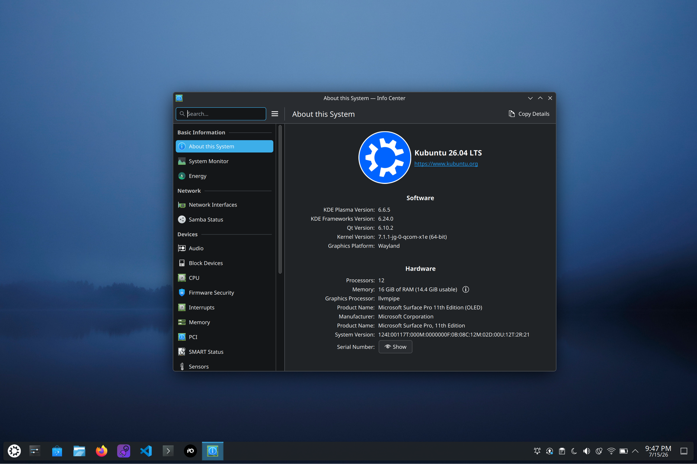

# ARM64 Linux on Microsoft Surface Pro 11



This repository is the experimental hardware-integration, evidence and release
channel for ARM64 Linux on the Microsoft Surface Pro 11. It carries downstream
kernel patch sets, device-support payloads, OpenEmbedded recipes, userspace
integration sources, test records and architecture decisions for both the
Snapdragon X Elite X1E/OLED and Snapdragon X Plus X1P/LCD variants.

[Lexr.sh](https://github.com/ooaklee/lexr.sh) is the supported companion CLI.
It turns the reviewed integration policy in this repository into guarded image,
kernel, userspace, private hand-off and clean-up workflows. This repository
pins the exact reviewed Lexr revision in the [`cli/lexr`](cli/lexr) submodule.
The compiled `lexr` CLI is the supported operator path; repository scripts are
not part of the current operator workflow. Lexr owns its source, issues and
binary-only releases, while kernel and device-support releases remain on the
established
[OE release page](https://github.com/ooaklee/linux-surface-pro-11-oe/releases).

> [!NOTE]
> Lexr.sh remains private during the repository migration. Only authenticated
> GitHub users with access to Lexr can populate `cli/lexr`; an ordinary clone
> of this OE repository still works, but CLI-dependent procedures require the
> populated submodule. The recorded HTTPS URL will work anonymously without
> another OE change when Lexr becomes public.

> [!WARNING]
> The generated media, custom kernels and hardware support remain
> experimental. Back up important data, keep a known-good boot entry and a
> separate recovery device, and disable Secure Boot before booting an unsigned
> custom kernel.

## Current targets and evidence

The primary recorded X1E hardware target is:

| Item | Value |
| --- | --- |
| Device | Microsoft Surface Pro, 11th Edition |
| SoC | Snapdragon X Elite `X1E80100` |
| Display | Samsung `ATNA33XC21-0`, 2880×1920 |
| Firmware/UEFI | `175.222.235`, dated 2026-02-23 |
| Internal disk | Samsung `MZ9L4512HBLU-00BMV-SAMSUNG`, 476.9 GiB NVMe |
| Windows source checked | Windows 11 Home Insider Preview build `29585` |
| Latest published project kernel | [`sp11v19`](https://github.com/ooaklee/linux-surface-pro-11-oe/releases/tag/sp11-qcom-x1e-7.2.0-jg-0sp11v19), based on Linux 7.2.0 |
| Exact project source | [`2cbd1ec3…`](https://github.com/ooaklee/linux_ms_dev_kit-sp11/commit/2cbd1ec3e2da385e7bd91fd65c63ba5a8fb5b865) |

The published `sp11v19` package is a Linux 7.2.0-based downstream integration,
not the latest official Linux kernel. As of 2026-08-31, kernel.org lists stable
7.2.2 and mainline 7.3-rc1; consult the current
[kernel.org release record](https://www.kernel.org/releases.json) rather than
inferring upstream status from the project release number. The final v19
rebuild was package- and source-validated but was not separately boot-tested as
one all-up image. Individual green entries below name hardware evidence from
the relevant accepted integration generation.

Legend: ✅ hardware-verified; ⚠️ hardware-verified with material limitations or
older-version scope; 🧪 experimental hardware result, not supported; 🧩
integrated and build-verified without variant-specific hardware acceptance; ❌
unsupported in the current project; ❓ no evidence found.

| Feature | X1E/OLED | X1P/LCD | Evidence boundary |
| --- | --- | --- | --- |
| NVMe boot | ✅ | 🧩 | X1E completed an [installed USB-free boot](docs/installed-nvme-boot-test-20260613.md); X1P shares the device-tree path but lacks an equivalent run. |
| Internal display | ✅ | ✅ | X1P panel boot and brightness were hardware-tested in [OE PR 50](https://github.com/ooaklee/linux-surface-pro-11-oe/pull/50). |
| 3D acceleration | ⚠️ | 🧩 | X1E has older hardware evidence; no separate X1P 3D acceptance run is recorded. |
| Backlight | ✅ DP AUX | ✅ PWM | X1P PWM support is [downstream project commit `350d7bd9…`](https://github.com/ooaklee/linux_ms_dev_kit-sp11/commit/350d7bd9eb51c9fe95dbcc71ee19513ef6630d7f), not an upstream Linux claim. |
| Direct USB 3 | ✅ | 🧩 | X1E passed the guarded USB4 control run; this does not qualify a Surface Dock. |
| USB4/Thunderbolt | ❌; 🧪 retimer-only | ❌ | No production router, domain or tunnel path exists; [kernel PR 24](https://github.com/ooaklee/linux_ms_dev_kit-sp11/pull/24) remains guarded and X1P trials can hard-lock. |
| Direct USB-C DP video | ⚠️ | 🧩 | X1E passed at 6.15-rc6 but has not been rerun against the current USB4 control; direct DP is not USB4 tunnelling. |
| DisplayPort audio | ❌ | ❌ | The current Denali graph has no DisplayPort DAI. |
| Wi-Fi | ✅ | 🧩 | X1E [scan, association, traffic and reconnect passed](docs/installed-wifi-clean-flow-test-20260614.md); downstream rfkill handling and distribution firmware remain required. |
| Bluetooth | ⚠️ | 🧩 | X1E pairing and A2DP music playback work well. Audible volume changes, but the desktop gauge can jump back to its connection-time position; [issue 58](https://github.com/ooaklee/linux-surface-pro-11-oe/issues/58) tracks that indicator desynchronisation. Suspend coverage remains incomplete. |
| Speakers | ✅ | 🧩 | X1E passed with the [FullIO v19c userspace/kernel pairing](docs/adr/adr-0064-sp11-audio-release-strategy.md); X1P has no separate hardware acceptance. |
| Microphone | ✅ | 🧩 | X1E PipeWire, browser and local capture passed with the v12 + FullIO v19c pairing in [issue 48's closing acceptance](https://github.com/ooaklee/linux-surface-pro-11-oe/issues/48#issuecomment-5436171174); [kernel PR 21](https://github.com/ooaklee/linux_ms_dev_kit-sp11/pull/21) supplies the current 4.8 MHz kernel path. |
| Touchscreen | ✅ | ✅ | X1P physical touch was explicitly tested in [kernel PR 18](https://github.com/ooaklee/linux_ms_dev_kit-sp11/pull/18); support is downstream project code. |
| Pen | ⚠️ | 🧩 | X1E pressure, tilt, hover and barrel-button paths passed under [ADR0067](docs/adr/adr-0067-sp11-kernel-hidraw-iptsd-pen-integration.md); eraser, recovery and repeated suspend remain open, and X1P lacks a device run. |
| Attached Flex Keyboard/touchpad | ⚠️ | 🧩 | X1E attached mode has [historical hardware evidence](https://github.com/dwhinham/linux-surface-pro-11/blob/169864c10ce902cf29600ecab4094c0d07ae3376/README.md#L29); the kernel uses the upstream [Surface Aggregator/KIP path](https://github.com/torvalds/linux/commit/c4a069095395ecd1e936f488511dfd9016b9c479). Detached Bluetooth and a current all-up regression remain open. |
| Volume rocker | ✅ | 🧩 | X1E press, hold-repeat and no-spurious-event checks passed in [issue 37](https://github.com/ooaklee/linux-surface-pro-11-oe/issues/37). |
| Battery | 🧩 | 🧩 | Provider arbitration is integrated, but no explicit charging and capacity acceptance record was found. |
| Power profiles | ✅ | 🧩 | X1E desktop mappings for power saver, balanced and performance passed in [kernel PR 16](https://github.com/ooaklee/linux_ms_dev_kit-sp11/pull/16); `balanced-performance` was exposed but not switched separately. |
| Suspend/resume | ⚠️ | ❓ | X1E remains partial and [issue 39](https://github.com/ooaklee/linux-surface-pro-11-oe/issues/39) is open. |
| Front RGB camera | 🧪 | ❌ | X1E raw and processed browser video passed under [kernel PR 22](https://github.com/ooaklee/linux_ms_dev_kit-sp11/pull/22), but calibration, auto-exposure, privacy and suspend gates remain; X1P has no camera node. |
| Front privacy LED | 🧩 | ❌ | X1E wiring exists, but polarity, lifetime and privacy behaviour are not qualified. |
| Rear camera | ❌ | ❌ | [Issue 41](https://github.com/ooaklee/linux-surface-pro-11-oe/issues/41) remains open. |
| IR/Windows Hello | ❌ | ❌ | [Issue 42](https://github.com/ooaklee/linux-surface-pro-11-oe/issues/42) remains open. |
| 5G | ❌ | ❌ | No project support evidence is recorded; the primary installed test target is Wi-Fi-only. |

The upstream boundary is narrower than this table. Linux v7.2's
[common Denali device tree](https://github.com/torvalds/linux/blob/v7.2/arch/arm64/boot/dts/qcom/x1-microsoft-denali.dtsi)
enables the common GPU, display, Wi-Fi, NVMe, Bluetooth and USB paths. The
[initial Denali commit](https://github.com/torvalds/linux/commit/0d72ccaa1e840b4c8723a929b2febbedcf5f80cd)
explicitly left touch, pen, cameras and status LEDs incomplete; the project
kernel supplies reviewed downstream integrations for several of those gaps.

The first implemented image adapter is
`ubuntu-concept-resolute-x1e`. Other ARM64 images can appear in the catalogue
without being buildable; `catalog show` reports an entry's actual support
level.

Fedora Workstation Live 44 is implemented by Lexr's `fedora-live` adapter.
Lexr owns its EROFS remastering, native custom-kernel RPM, boot policy,
Anaconda hand-off, and ISO validation. This repository owns the corresponding
reusable [Fedora IPTSD package-source input](userspace/iptsd-sp11/packaging/fedora/README.md),
not a second Fedora build or remastering workflow.

## Build the CLI

The build host needs Go 1.26 or newer. Image and kernel builds also need a
running Docker daemon with Linux ARM64 container support. Initialise the pinned
submodule after cloning this repository, then build Lexr from its module.

For a new checkout, configure GitHub HTTPS credentials with access to Lexr
while it remains private, then clone both repositories together:

```sh
git clone --recurse-submodules \
  --branch cli/linux-armer \
  https://github.com/ooaklee/linux-surface-pro-11-oe.git
cd linux-surface-pro-11-oe
```

For an existing checkout, initialise the same pinned submodule explicitly:

```sh
git fetch origin cli/linux-armer
git switch cli/linux-armer
git pull --ff-only
git submodule sync -- cli/lexr
git submodule update --init --recursive cli/lexr
```

These examples select the integration branch explicitly while the cut-over is
under review. Omit `--branch cli/linux-armer` and the branch-switching steps
after the same changes reach the repository's default branch.

While Lexr remains private, both forms require GitHub HTTPS credentials with
access to `ooaklee/lexr.sh`. Once that repository is public, the recorded HTTPS
submodule URL will work without authentication.

Then use the provenance-aware source builder and run the command:

```sh
go -C cli/lexr run ./cmd/lexr-build
./cli/lexr/bin/lexr version
./cli/lexr/bin/lexr doctor
```

The builder records the pinned Lexr revision explicitly and avoids attributing
the enclosing OE checkout's revision to the executable.

Lexr-dependent GitHub Actions are owned and run by the
[standalone Lexr.sh repository](https://github.com/ooaklee/lexr.sh). Lexr
releases contain only compiled platform executables and their checksum
manifest. Kernel builds use a separate, manually dispatched Lexr workflow. Its
GitHub-hosted publication step uses a dedicated, repository-scoped credential
to publish an explicitly requested experimental kernel prerelease to this OE
repository. The credential is not exposed to pull-request validation or the
self-hosted kernel build. The publisher resolves this repository's `main` ref
to an exact revision, refuses to reuse an existing release tag, and verifies
the new tag before promotion. Kernel and other device-support releases
therefore keep their established OE URLs.

Clone [the standalone Lexr.sh repository](https://github.com/ooaklee/lexr.sh)
instead when working on the CLI independently of this OE integration. Run
`lexr` in an interactive terminal to open the wizard, or use the same services
through explicit subcommands. `lexr <command> --help` shows the options
implemented by that command. The examples below use `lexr` for a binary
installed on `PATH`; substitute `./cli/lexr/bin/lexr` when running directly
from this checkout.

Lexr.sh is the product name and `lexr` is the command. The pinned pre-`0.1.0`
naming boundary is intentionally Lexr-only: image manifests use schema 4 and
`/sp11/lexr-manifest.json`; Windows hand-offs use schema 3 and collector
`3.0.0`; application receipts use schema 2; private imports live beneath
`${HOME}/.lexr-handoffs`; and installed recovery state lives beneath
`/var/lib/lexr`. Current kernel bundle, provenance and release manifests use
`lexr-kernel-*.json`. Recreate pre-release media and recollect unpublished
hand-offs made with an earlier contract rather than silently reinterpreting
them. Existing OE repository and release URLs remain stable external
provenance.

## End-to-end workflow

### 1. Inspect the source-image catalogue

```sh
lexr catalog validate
lexr catalog list
lexr catalog show ubuntu-concept-resolute-x1e
```

Catalogue-only entries are useful references, but `image create` accepts only
an entry with an implemented adapter.

### 2. Obtain a kernel bundle

Build the maintained custom kernel in the CLI-owned ARM64 container workflow:

```sh
lexr kernel build --dry-run
lexr kernel build \
  --output-dir build/lexr/kernel-current
lexr kernel inspect build/lexr/kernel-current
```

Use `--git-url` and `--git-branch` only when intentionally testing another
kernel source. `--reset-source` resets the source tree in the CLI-owned work
volume; it does not modify a host checkout.

Alternatively, download a published, checksum-verified kernel release:

```sh
lexr kernel release list
lexr kernel release download latest \
  --output-dir build/lexr/kernel-bundle
lexr kernel inspect build/lexr/kernel-bundle
```

These commands use the established
[`ooaklee/linux-surface-pro-11-oe` release channel](https://github.com/ooaklee/linux-surface-pro-11-oe/releases)
by default. Select another repository only when intentionally testing a
compatible alternative.

See [Build a Patched qcom-x1e Kernel](docs/how-to/how-to-build-patched-qcom-x1e-kernel.md)
and [Prepare Kernel Release Artefacts](docs/how-to/how-to-release-kernel-artifacts.md)
for the detailed build and release paths.

### 3. Create the live image

Use a local upstream image and record its independently obtained SHA-256 when
possible:

```sh
lexr image create \
  --source resolute-desktop-arm64+x1e-20260326.iso \
  --source-sha256 "<sha256>" \
  --kernel-dir build/lexr/kernel-bundle \
  --output build/lexr/lexr-ubuntu-sp11.iso
```

Omit `--source` to let the catalogue download the pinned source, or replace
`--kernel-dir` with `--kernel-release latest`. Select an exact release tag for
a reproducible build. Add `--dry-run` to review the plan without remastering.

To carry the companion CLI, maintained source and an eligible offline IPTSD
release on the medium:

```sh
lexr image create \
  --source resolute-desktop-arm64+x1e-20260326.iso \
  --source-sha256 "<sha256>" \
  --kernel-release latest \
  --companion-source-dir cli/lexr \
  --companion-userspace iptsd \
  --output build/lexr/lexr-ubuntu-sp11.iso
```

The image contains one logical schema-4 inventory. Its on-media copy is
`/sp11/lexr-manifest.json`, and the generated ISO has the matching sidecar
representation. `companion_bundle` is an attribute of that existing ISO
manifest, including when no companion is requested. It is never a separate
companion manifest. Portable userspace receipts verify their own component
files but do not create another ISO inventory. Private Windows hand-offs are
never companion content.

### 4. Validate and write the USB

```sh
lexr image validate build/lexr/lexr-ubuntu-sp11.iso
lexr image devices
lexr image write build/lexr/lexr-ubuntu-sp11.iso \
  --device "<whole-device>" \
  --dry-run

sudo lexr image write build/lexr/lexr-ubuntu-sp11.iso \
  --device "<whole-device>" \
  --confirm '<exact phrase from the current dry run>'
```

Review the current dry run, then use its exact device-bound confirmation in the
privileged command. The CLI never elevates itself. The writer rejects unsafe
targets and succeeds only after a full SHA-256 read-back and safe ejection.

### 5. Install while retaining a fallback

Keep the running, known-good ABI installed. Inspect the downloaded bundle,
then preflight the target before changing it:

```sh
KNOWN_GOOD_ABI="$(uname -r)"
lexr kernel inspect build/lexr/kernel-bundle
lexr kernel preflight build/lexr/kernel-bundle \
  --root / \
  --fallback-abi "$KNOWN_GOOD_ABI"
lexr kernel install build/lexr/kernel-bundle \
  --root / \
  --fallback-abi "$KNOWN_GOOD_ABI" \
  --dry-run
```

Review the plan, then repeat `kernel install` with elevated privileges and
`--yes`. For an installed system mounted below a live environment, replace `/`
with that absolute mount point. The full recovery procedure is in
[Reinstall a Patched Kernel from USB](docs/how-to/how-to-reinstall-patched-kernel-from-usb.md).

### 6. Manage userspace support

```sh
lexr userspace catalog validate
lexr userspace list
lexr userspace status
lexr userspace pull recommended --cache-dir build/lexr/userspace
lexr userspace install recommended \
  --from build/lexr/userspace \
  --dry-run
```

Repeat the install with elevated privileges and `--yes` after reviewing it.
IPTSD and camera components also have maintained native builds. Camera supports
a non-mutating plan; the IPTSD build executes when invoked:

```sh
lexr userspace build iptsd \
  --output-dir build/lexr/iptsd
lexr userspace build camera \
  --output-dir build/lexr/camera \
  --dry-run
```

Audio, pen and camera have different support grades. Inspect
`lexr userspace show <component>` before changing a system.

### 7. Diagnose the host and device

```sh
lexr doctor
lexr doctor userspace
lexr doctor hardware wifi bluetooth audio
```

Use `--root <absolute-path>` with the userspace or hardware doctor to inspect a
mounted target. Diagnostic commands do not change the system. Review their
output before sharing it because host diagnostics can include environment
paths; device diagnostics deliberately omit private device identities.

### 8. Import private Windows material

Some device-bound platform firmware and the Bluetooth public address must come
from the same Surface. On Windows, run the canonical collector from this
checkout's initialised Lexr submodule. First follow Lexr's
[protected-parent procedure](https://github.com/ooaklee/lexr.sh#collect-on-windows)
in the same elevated PowerShell session. It creates a new private parent on the
fixed local NTFS volume; never use removable storage as the collector's live
output transaction.

```powershell
$privateParent = Join-Path $env:ProgramFiles 'lexr-private'
$handoff = Join-Path $privateParent `
  ('sp11-handoff-' + (Get-Date -Format 'yyyyMMdd-HHmmss'))

powershell -NoProfile -ExecutionPolicy Bypass `
  -File .\cli\lexr\tools\collect-sp11-windows-handoff.ps1 `
  -OutputDirectory $handoff
if ($LASTEXITCODE -ne 0) {
  throw 'Windows hand-off collection failed.'
}
```

The collector never exports Windows Wi-Fi firmware. Treat its output as
private, device-bound and proprietary; do not publish it or add it to an image
or release. After the collector succeeds, follow the same procedure to copy
the completed child to a new directory on trusted removable storage. Move that
private transfer copy to Linux, then validate and import it:

```sh
HANDOFF_STORE="${HOME}/.lexr-handoffs"
lexr handoff import "<private-handoff-directory>" --store "$HANDOFF_STORE"
lexr handoff list --store "$HANDOFF_STORE"
lexr handoff apply "<id>" \
  --store "$HANDOFF_STORE" \
  --target-root / \
  --feature firmware \
  --feature bluetooth \
  --adsp-policy enabled \
  --dry-run

sudo lexr handoff apply "<id>" \
  --store "$HANDOFF_STORE" \
  --target-root / \
  --feature firmware \
  --feature bluetooth \
  --adsp-policy enabled \
  --confirm '<exact phrase from the current dry run>'
```

The unprivileged shell expands `$HOME`, so `HANDOFF_STORE` remains the same
absolute user-store path when it is passed through `sudo`.

Use `--adsp-policy disabled` for a live USB target and `enabled` for the
installed NVMe system. `handoff restore` runs with `sudo` and reads its receipt
beneath the target rather than the hand-off store. `handoff purge` must receive
`--store "$HANDOFF_STORE"` when removing a reviewed private import.

### 9. Detect and recover from recognised legacy changes

Never remove old workarounds by guessing paths. Build an exact plan from the
CLI's bounded allow-list:

```sh
lexr clean scan --root /
lexr clean plan --root / \
  --output lexr-cleanup-plan.json
sudo lexr clean apply --root / \
  --plan lexr-cleanup-plan.json \
  --yes
```

Keep the durable receipt. If needed, validate and restore the captured entries:

```sh
sudo lexr clean restore \
  "/var/lib/lexr/backups/<transaction>/receipt.json" \
  --root / \
  --yes
```

## Repository boundary

The former `scripts/` tree, its three shell tests, three root helper tools and
script-only workflow were removed after the complete native outcome register
in [Lexr ADR010](https://github.com/ooaklee/lexr.sh/blob/main/docs/adr/adr-010-native-cli-workflow-migration.md)
passed review. [OE ADR0070](docs/adr/adr-0070-retire-superseded-repository-scripts.md)
records the corresponding repository decision.

OE still carries the patch bytes, userspace integration sources, OpenEmbedded
recipes and device evidence needed for provenance and builds. Patch-set README
files mark retired injection flows as archived compatibility evidence. Dated
reports and historical ADR bodies may quote the commands used during discovery;
their current notices identify the Lexr owner and prevent those commands from
becoming present-day instructions.

## Current guidance

- [Lexr.sh CLI reference, source and safety model](https://github.com/ooaklee/lexr.sh)
- [Lexr.sh supported image catalogue](https://github.com/ooaklee/lexr.sh/blob/main/supported-isos.json)
- [Lexr.sh CLI binary releases](https://github.com/ooaklee/lexr.sh/releases)
- [OE kernel and device-support releases](https://github.com/ooaklee/linux-surface-pro-11-oe/releases)
- [Use Lexr from the OE repository](docs/how-to/how-to-use-lexr.md)
- [How-to guides](docs/how-to/)
- [Architecture decisions](docs/adr/)
- [Standalone Lexr and OE workflow ownership](docs/adr/adr-0069-standalone-lexr-workflow-ownership.md)
- [Retire superseded repository scripts](docs/adr/adr-0070-retire-superseded-repository-scripts.md)
- [Kernel release preparation](docs/how-to/how-to-release-kernel-artifacts.md)
- [Kernel recovery from USB](docs/how-to/how-to-reinstall-patched-kernel-from-usb.md)

Documents and reports with explicit historical dates remain evidence of the
experiments they describe. Use the standalone Lexr.sh guidance for current CLI
behaviour and this README and the current OE how-to guides for integration
actions.

## Sources and credit

- Lexr companion CLI: <https://github.com/ooaklee/lexr.sh>
- Surface Pro 11 downstream integration kernel: <https://github.com/ooaklee/linux_ms_dev_kit-sp11>
- Surface Laptop 7 Ubuntu notes by Bryce Hoehn: <https://github.com/bryce-hoehn/linux-surface-laptop-7>
- Surface Pro 11 Arch notes by Dan Whinham: <https://github.com/dwhinham/linux-surface-pro-11>
- linux-surface project and Surface Pro 11 discussion: <https://github.com/linux-surface/linux-surface/issues/1962>
- Johan Glathe's Snapdragon X Elite kernel work: <https://github.com/jglathe/linux_ms_dev_kit>
- Linaro Snapdragon X Elite enablement: <https://git.codelinaro.org/linaro/qcomlt/demos/debian-12-installer-image>
- WOA Project Qualcomm reference drivers: <https://github.com/WOA-Project/Qualcomm-Reference-Drivers>
