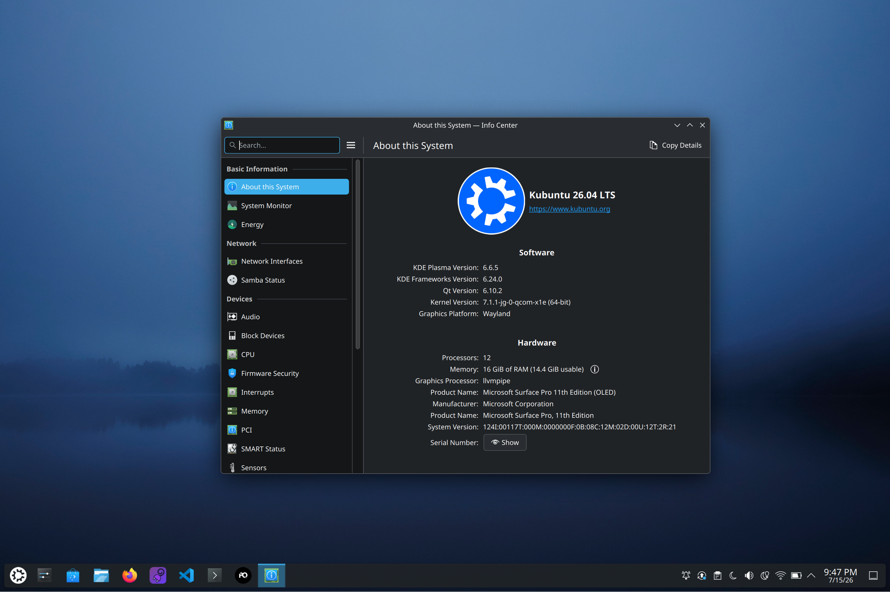

# ARM64 Linux on Microsoft Surface Pro 11

## Compatible distributions and image downloads

These experimental ARM64 live images target the Surface Pro 11 **X1E/OLED**
and include [Lexr v0.5.0-rc.3](https://github.com/ooaklee/lexr.sh/releases/tag/v0.5.0-rc.3)
and the [SP11 v23 kernel](https://github.com/ooaklee/linux-surface-pro-11-oe/releases/tag/sp11-qcom-x1e-7.2.0-jg-0sp11v23).
Read each release's download instructions and hardware testing limits before
choosing an image.

| Distribution | Upstream source | Image release |
| --- | --- | --- |
| Ubuntu Concept Resolute | ARM64 X1E desktop snapshot, 2026-03-26 | [Ubuntu Concept v23](https://github.com/ooaklee/linux-surface-pro-11-oe/releases/tag/sp11-ubuntu-concept-26.04-v23-20260927) |
| elementary OS 8.1 | ARM64 stable image, 2026-02-19 | [elementary OS v23](https://github.com/ooaklee/linux-surface-pro-11-oe/releases/tag/sp11-elementary-os-8.1-v23-20260927) |
| Debian Live GNOME | ARM64 Debian 13 testing snapshot, 2024-09-02 | [Debian Live v23](https://github.com/ooaklee/linux-surface-pro-11-oe/releases/tag/sp11-debian-13-gnome-v23-20260927) |
| Fedora Workstation Live 44 | AArch64 image, 44-1.7 | [Fedora Workstation v23](https://github.com/ooaklee/linux-surface-pro-11-oe/releases/tag/sp11-fedora-workstation-44-v23-20260927) |
| Arch Linux ARM | AArch64 root filesystem snapshot, 2026-08-05; terminal live ISO with no desktop preselected | [Arch Linux ARM terminal v23](https://github.com/ooaklee/linux-surface-pro-11-oe/releases/tag/sp11-arch-linux-arm-terminal-v23-20260927) |

You can also [build your own](https://github.com/ooaklee/lexr.sh/blob/main/README.md#create-your-first-image)
image with Lexr.

Installation guidance supports keeping Windows or another Linux system as a
fallback. The [Arch partitioning walkthrough](https://github.com/ooaklee/lexr.sh/blob/main/docs/user-guide/arch-linux-arm-quickstart.md#2-select-only-the-space-reserved-for-arch)
shows how to install into reserved space and reuse the existing EFI System
Partition without formatting it or changing other OS partitions.

The Debian and Arch sources are dated snapshots, not current distribution
media. Build and checksum validation alone do not establish hardware support.

**Preparing the USB on Windows?** Use the
[Windows image-to-USB guide](https://github.com/ooaklee/lexr.sh/blob/main/docs/user-guide/windows-image-usb.md) to join the parts, decompress
and verify the image, flash it with Etcher, and configure Secure Boot and USB
boot. **Already running Linux?** Follow the release's Lexr download and
validation commands, then the [Lexr USB workflow](https://github.com/ooaklee/lexr.sh/blob/main/docs/user-guide/installation-media.md#2-review-the-usb-target).

## About this repository



This repository maintains kernel patches, userspace support, OpenEmbedded
recipes and hardware test records for ARM64 Linux on the Microsoft Surface
Pro 11: Snapdragon X Elite (X1E/OLED) and Snapdragon X Plus (X1P/LCD).

[Lexr](https://github.com/ooaklee/lexr.sh) provides the CLI for preparing images,
managing kernels and setting up device support. Its source, documentation and
CLI releases live in the Lexr repository. Images, kernels and device-support
packages are published on the [OE releases page](https://github.com/ooaklee/linux-surface-pro-11-oe/releases).

> [!WARNING]
> The generated media, custom kernels and hardware support remain
> experimental. Back up important data, keep a known-good boot entry and a
> separate recovery device, and disable Secure Boot before booting an unsigned
> custom kernel.

## Current targets and evidence

The primary recorded X1E hardware target is:

| Item | Value |
| --- | --- |
| Device | Microsoft Surface Pro, 11th Edition |
| SoC | Snapdragon X Elite `X1E80100` |
| Display | Samsung `ATNA33XC21-0`, 2880×1920 |
| Firmware/UEFI | `175.222.235`, dated 2026-02-23 |
| Internal disk | Samsung `MZ9L4512HBLU-00BMV-SAMSUNG`, 476.9 GiB NVMe |
| Windows source checked | Windows 11 Home Insider Preview build `29585` |
| Kernel used for these images | [`7.2.0-jg-0sp11v23`](https://github.com/ooaklee/linux-surface-pro-11-oe/releases/tag/sp11-qcom-x1e-7.2.0-jg-0sp11v23), based on Linux 7.2.0 |
| Exact kernel source | [`ce78e6ebc3d7…`](https://github.com/ooaklee/linux_ms_dev_kit-sp11/commit/ce78e6ebc3d70c4a316b5721a62478ca87d6cb46) |

The [v23 release notes](https://github.com/ooaklee/linux-surface-pro-11-oe/releases/tag/sp11-qcom-x1e-7.2.0-jg-0sp11v23)
and [manifest](https://github.com/ooaklee/linux-surface-pro-11-oe/releases/download/sp11-qcom-x1e-7.2.0-jg-0sp11v23/lexr-kernel-release-manifest.json)
identify the kernel, matching device trees and tested userspace combinations.
The table below spans several integration versions; it does not certify every
feature on every image above.

Legend: ✅ hardware-verified; ⚠️ hardware-verified with material limitations or
older-version scope; 🧪 experimental hardware result, not supported; 🧩
integrated and build-verified without variant-specific hardware acceptance; ❌
unsupported in the current project; ❓ no evidence found.

| Feature | X1E/OLED | X1P/LCD | Evidence boundary |
| --- | --- | --- | --- |
| NVMe boot | ✅ | 🧩 | X1E completed an [installed USB-free boot](docs/installed-nvme-boot-test-20260613.md); X1P shares the device-tree path but lacks an equivalent run. |
| Internal display | ✅ | ✅ | X1P panel boot and brightness were hardware-tested in [OE PR 50](https://github.com/ooaklee/linux-surface-pro-11-oe/pull/50). |
| 3D acceleration | ⚠️ | 🧩 | X1E has older hardware evidence; no separate X1P 3D acceptance run is recorded. |
| Backlight | ✅ DP AUX | ✅ PWM | X1P PWM support is [downstream project commit `350d7bd9…`](https://github.com/ooaklee/linux_ms_dev_kit-sp11/commit/350d7bd9eb51c9fe95dbcc71ee19513ef6630d7f), not an upstream Linux claim. |
| Direct USB 3 | ✅ | 🧩 | X1E passed the guarded USB4 control run; this does not qualify a Surface Dock. |
| USB4/Thunderbolt | ❌; 🧪 retimer-only | ❌ | No production router, domain or tunnel path exists; [kernel PR 24](https://github.com/ooaklee/linux_ms_dev_kit-sp11/pull/24) remains guarded and X1P trials can hard-lock. |
| Direct USB-C DP video | ⚠️ | 🧩 | X1E passed at 6.15-rc6 but has not been rerun against the current USB4 control; direct DP is not USB4 tunnelling. |
| DisplayPort audio | ❌ | ❌ | The current Denali graph has no DisplayPort DAI. |
| Wi-Fi | ✅ | 🧩 | X1E [scan, association, traffic and reconnect passed](docs/installed-wifi-clean-flow-test-20260614.md); downstream rfkill handling and distribution firmware remain required. |
| Bluetooth | ⚠️ | 🧩 | X1E pairing and A2DP music playback work well. Audible volume changes, but the desktop gauge can jump back to its connection-time position; [issue 58](https://github.com/ooaklee/linux-surface-pro-11-oe/issues/58) tracks that indicator desynchronisation. Suspend coverage remains incomplete. |
| Speakers | ✅ | 🧩 | X1E passed with the [FullIO v19c userspace/kernel pairing](docs/adr/adr-0064-sp11-audio-release-strategy.md); X1P has no separate hardware acceptance. |
| Microphone | ✅ | 🧩 | X1E PipeWire, browser and local capture passed with the v12 + FullIO v19c pairing in [issue 48's closing acceptance](https://github.com/ooaklee/linux-surface-pro-11-oe/issues/48#issuecomment-5436171174); [kernel PR 21](https://github.com/ooaklee/linux_ms_dev_kit-sp11/pull/21) supplies the current 4.8 MHz kernel path. |
| Touchscreen | ✅ | ✅ | X1P physical touch was explicitly tested in [kernel PR 18](https://github.com/ooaklee/linux_ms_dev_kit-sp11/pull/18); support is downstream project code. |
| Pen | ⚠️ | 🧩 | X1E pressure, tilt, hover and barrel-button paths passed under [ADR0067](docs/adr/adr-0067-sp11-kernel-hidraw-iptsd-pen-integration.md); eraser, recovery and repeated suspend remain open, and X1P lacks a device run. |
| Attached Flex Keyboard/touchpad | ⚠️ | 🧩 | X1E attached mode has [historical hardware evidence](https://github.com/dwhinham/linux-surface-pro-11/blob/169864c10ce902cf29600ecab4094c0d07ae3376/README.md#L29); the kernel uses the upstream [Surface Aggregator/KIP path](https://github.com/torvalds/linux/commit/c4a069095395ecd1e936f488511dfd9016b9c479). Detached Bluetooth and a current all-up regression remain open. |
| Volume rocker | ✅ | 🧩 | X1E press, hold-repeat and no-spurious-event checks passed in [issue 37](https://github.com/ooaklee/linux-surface-pro-11-oe/issues/37). |
| Battery | 🧩 | 🧩 | Provider arbitration is integrated, but no explicit charging and capacity acceptance record was found. |
| Power profiles | ✅ | 🧩 | X1E desktop mappings for power saver, balanced and performance passed in [kernel PR 16](https://github.com/ooaklee/linux_ms_dev_kit-sp11/pull/16); `balanced-performance` was exposed but not switched separately. |
| Suspend/resume | ⚠️ | ❓ | X1E remains partial and [issue 39](https://github.com/ooaklee/linux-surface-pro-11-oe/issues/39) is open. |
| Front RGB camera | 🧪 | ❌ | X1E raw and processed browser video passed under [kernel PR 22](https://github.com/ooaklee/linux_ms_dev_kit-sp11/pull/22), but calibration, auto-exposure, privacy and suspend gates remain; X1P has no camera node. |
| Front privacy LED | 🧩 | ❌ | X1E wiring exists, but polarity, lifetime and privacy behaviour are not qualified. |
| Rear camera | ❌ | ❌ | [Issue 41](https://github.com/ooaklee/linux-surface-pro-11-oe/issues/41) remains open. |
| IR/Windows Hello | ❌ | ❌ | [Issue 42](https://github.com/ooaklee/linux-surface-pro-11-oe/issues/42) remains open. |
| 5G | ❌ | ❌ | No project support evidence is recorded; the primary installed test target is Wi-Fi-only. |

The upstream boundary is narrower than this table. Linux v7.2's
[common Denali device tree](https://github.com/torvalds/linux/blob/v7.2/arch/arm64/boot/dts/qcom/x1-microsoft-denali.dtsi)
enables the common GPU, display, Wi-Fi, NVMe, Bluetooth and USB paths. The
[initial Denali commit](https://github.com/torvalds/linux/commit/0d72ccaa1e840b4c8723a929b2febbedcf5f80cd)
explicitly left touch, pen, cameras and status LEDs incomplete; the project
kernel supplies reviewed downstream integrations for several of those gaps.

## Current guidance

Start with [Install Lexr](https://github.com/ooaklee/lexr.sh/blob/main/docs/getting-started/install.md)
and the [first-image quickstart](https://github.com/ooaklee/lexr.sh/blob/main/docs/getting-started/index.md).
For host requirements and command syntax, use Lexr's
[requirements](https://github.com/ooaklee/lexr.sh/blob/main/docs/reference/requirements.md)
and [command reference](https://github.com/ooaklee/lexr.sh/blob/main/docs/reference/command-reference.md).

| Task | Lexr guide |
| --- | --- |
| Create, validate and write installation media | [Installation media](https://github.com/ooaklee/lexr.sh/blob/main/docs/user-guide/installation-media.md) |
| Include the CLI and support files for offline use | [Offline companion](https://github.com/ooaklee/lexr.sh/blob/main/docs/user-guide/offline-companion.md) |
| Download, build or inspect a kernel bundle | [Kernel management](https://github.com/ooaklee/lexr.sh/blob/main/docs/operator-manual/kernel-management.md) |
| Install a released kernel and retain a fallback on Debian or Ubuntu | [Kernel and userspace installation](https://github.com/ooaklee/lexr.sh/blob/main/docs/user-guide/install-released-kernel-and-userspace.md) |
| Audit and configure audio, pen, camera and other support | [Userspace support](https://github.com/ooaklee/lexr.sh/blob/main/docs/user-guide/userspace-support.md) |
| Diagnose the host or device | [Diagnostics](https://github.com/ooaklee/lexr.sh/blob/main/docs/reference/command-reference.md#diagnostics) |
| Transfer private firmware and Bluetooth evidence from Windows | [Windows hand-off](https://github.com/ooaklee/lexr.sh/blob/main/docs/user-guide/windows-handoff.md) |
| Remove recognised legacy workarounds or restore a cleanup | [Reversible cleanup](https://github.com/ooaklee/lexr.sh/blob/main/docs/user-guide/reversible-cleanup.md) |

These guides track Lexr's `main` branch. Follow the selected image release's
instructions and check your CLI version when using the pinned rc.3 companion.
Windows hand-offs contain private, device-bound data; never add them to an
image, release or public support report.

For OE-specific tasks, see [kernel recovery from USB](docs/how-to/how-to-reinstall-patched-kernel-from-usb.md),
[kernel release preparation](docs/how-to/how-to-release-kernel-artifacts.md)
and the [how-to index](docs/how-to/).

## Build the CLI

To use the exact Lexr source selected by this OE checkout, initialise the
[`cli/lexr`](cli/lexr) submodule and build it with Go 1.26 or newer. It is
pinned to [v0.5.0-rc.3 at `1209416`](https://github.com/ooaklee/lexr.sh/commit/120941632db2d2b086983c6cd2e90320d25a0999),
the revision used for the image releases above.

```sh
git clone --recurse-submodules https://github.com/ooaklee/linux-surface-pro-11-oe.git
cd linux-surface-pro-11-oe
go -C cli/lexr run ./cmd/lexr-build
./cli/lexr/bin/lexr version
```

For an existing checkout, run `git submodule update --init --recursive cli/lexr`
from the repository root first. The source builder records Lexr's own revision
in the executable. See [Use Lexr from OE](docs/how-to/how-to-use-lexr.md) for
more detail, including the Windows collector in the pinned submodule.
CLI development belongs in the [Lexr repository](https://github.com/ooaklee/lexr.sh).

## Repository boundary

| Content | Location |
| --- | --- |
| Kernel patches and archived integration notes | [patches/](patches/) |
| Source-owned compatibility declarations for new userspace packaging | [Userspace compatibility](userspace/compatibility/README.md) |
| Device-support sources, including Fedora IPTSD package inputs | [userspace/](userspace/) and [Fedora packaging](userspace/iptsd-sp11/packaging/fedora/README.md) |
| OpenEmbedded recipes | [meta-sp11/](meta-sp11/README.md) |
| Hardware reports and integration guides | [docs/](docs/) |
| Architecture decisions | [docs/adr/](docs/adr/) |

Lexr owns image preparation and CLI automation; OE supplies the integration
inputs and hardware evidence. [ADR0069](docs/adr/adr-0069-standalone-lexr-workflow-ownership.md)
records that split, and [ADR0070](docs/adr/adr-0070-retire-superseded-repository-scripts.md)
records the retirement of the old repository scripts. Commands in dated
reports and archived patch notes describe past experiments; use the current
guides above for setup.

## Sources and credit

- Lexr companion CLI: <https://github.com/ooaklee/lexr.sh>
- Surface Pro 11 downstream integration kernel: <https://github.com/ooaklee/linux_ms_dev_kit-sp11>
- Surface Laptop 7 Ubuntu notes by Bryce Hoehn: <https://github.com/bryce-hoehn/linux-surface-laptop-7>
- Surface Pro 11 Arch notes by Dan Whinham: <https://github.com/dwhinham/linux-surface-pro-11>
- linux-surface project and Surface Pro 11 discussion: <https://github.com/linux-surface/linux-surface/issues/1962>
- Johan Glathe's Snapdragon X Elite kernel work: <https://github.com/jglathe/linux_ms_dev_kit>
- Linaro Snapdragon X Elite enablement: <https://git.codelinaro.org/linaro/qcomlt/demos/debian-12-installer-image>
- WOA Project Qualcomm reference drivers: <https://github.com/WOA-Project/Qualcomm-Reference-Drivers>
