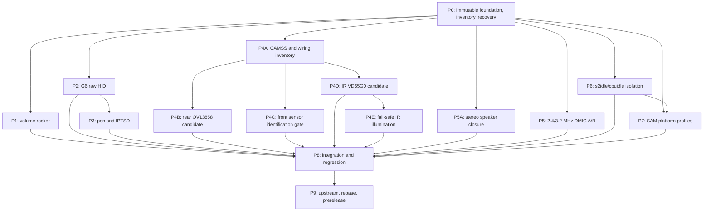

# Surface Pro 11 Full-Feature-Parity Execution Plan

This document is the execution backlog for closing the remaining experimental
Linux hardware gaps on the Surface Pro 11 OLED/X1E80100 target. It is a plan,
not a feature announcement. A task is complete only when its acceptance
evidence has been captured on the target and reviewed.

The programme uses the thin-kernel-fork boundary accepted in
[ADR-0052](adr/adr-0052-thin-sp11-kernel-integration-fork.md), the one-shot boot
contract accepted in
[ADR-0053](adr/adr-0053-one-shot-experimental-kernel-boot.md), and the public
[feature-parity source ledger](sp11-feature-parity-source-ledger.md). The
support repository remains the owner of build recipes, packages, userspace,
evidence, images, and releases. The thin fork is a temporary integration and
upstream-preparation workspace.

[ADR-0055](adr/adr-0055-retire-installed-loose-dtb-injection.md) also fixes the
installed boot boundary: each tested qcom-x1e Stubble image carries its exact
DTB, and the support installer retires shared loose-DTB selection and
generated-GRUB rewriting.

## Outcome and non-claims

The desired end state is an experimental Linux stack that can be tested for
the following candidate capabilities:

- native volume-up and volume-down events from the hardware rocker;
- G6 raw HID reports and pen hover, strokes, pressure, buttons, and eraser;
- front RGB, rear RGB, and IR camera capture through CAMSS;
- fail-safe IR illumination, if a safe public implementation basis can be
  established;
- stable stereo speaker routing through SoundWire/WSA8845 without a manual
  desktop workaround or uncontrolled initial volume;
- an objective 2.4 MHz versus 3.2 MHz DMIC decision;
- repeatable s2idle suspend and resume with a qualified cpuidle policy; and
- conservative firmware/platform performance profiles.

The public [feature demonstration](https://www.youtube.com/watch?v=WJqRIeTjUbI)
shows that these outcomes may be feasible on comparable hardware. It does not
prove that they work in this repository, identify a reusable implementation,
or establish safe hardware values. The claimed camera modes, `045e:0c83` G6
identity, 3.2 MHz DMIC clock, disabled deep idle state, and 2.515 GHz
power-saver ceiling are test targets to verify, not constants to copy.

Existing v3 touchscreen and audio results remain regression baselines as
recorded elsewhere in this repository. They do not waive any gate below, and
no new feature may be labelled working from a successful probe alone.

## Current starting point

The starting state is intentionally conservative:

| Area | Recorded starting point | Programme state |
|---|---|---|
| Kernel baseline | Johan G. tag `jg/ubuntu-qcom-x1e-7.2-rc5-jg-0` is pinned to `8f953dd060bc6e8fb86ca2ea8a92f258141c0169` | Deterministic signing-independent kernel/Deb identity and the raw matched-pair gate are implemented and fixture-tested, but no fresh C/D pair exists; one earlier real clean build verified the immutable-APT/provenance path, while byte reproducibility, signing, licensing, recovery, and release authorization remain open |
| Thin fork | The immutable base remains at `8f953dd060bc6e8fb86ca2ea8a92f258141c0169`; CI foundation commit `971b5af85ed0c7283ffb33430badeac9b5575057` is merged to the protected integration branch | Base and integration rules are active and thin-fork CI is green; no parity feature is accepted by branch presence |
| Recovery | `7.2-rc5-jg-0sp11v3-qcom-x1e` is running and named by the effective static `GRUB_DEFAULT`, while `grubenv`'s stale `saved_entry` still names v2 | ADR0053 deliberately rejects mixed static/saved semantics; one-shot apply is blocked until `GRUB_DEFAULT=saved` and `saved_entry` both resolve to known-good v3, then P0 must capture the no-op canary and physical-recovery evidence |
| Installed DTB path | Repository support retires its loose-DTB helper and kernel hooks under ADR0055; the exact Stubble image is authoritative | Target migration, successful normal GRUB regeneration, absence of project-managed loose-DTB lines, and packaged/embedded/active-FDT pairing remain pending P0 evidence |
| Evidence tooling | The schema-3 collector ran read-only on the target; its sanitized inventory and a separately filtered bounded kernel-log extract passed manual privacy review | P0.6 is complete for this target observation; the [2026-08-07 Wave 1 evidence report](sp11-wave1-read-only-target-evidence-20260807.md) records only reviewed conclusions, while raw output and access details remain unpublished |
| Input | Repository evidence records current touchscreen results but no raw-pen service and no qualified native volume-rocker mapping | Touch is a regression gate; P1-P3 remain open |
| Cameras | The recorded target inventory exposes no qualified media graph or video node; pinned ACPI also assigns secure SISP the MMIO and interrupts used by two generic CAMSS instances | P4A.1 and P4A.3 are complete research gates, P4A.2 is in evidence review, and an unmodified CAMSS probe is blocked |
| Audio | Repository evidence records a 2.4 MHz microphone baseline and stereo output that still needs routing/distortion closure | P5 remains open |
| Power/platform | `deep` was selected during the passive sample; no suspend occurred. The live SSAM `f02` client is the registry-defined thermal sensor, while the profile driver's `f01` client is absent | P6.1 and P7.1 are in evidence review; suspend, active profile discovery, and every write remain blocked |

At drafting on 2026-08-07, P0 is `in-progress` and P1-P9 are `blocked` on P0.
Update this table as gates close; branch presence alone never changes status.

## Evidence and provenance boundary

Every design statement must be classified before implementation.

| Class | Examples | What it permits | What it does not permit |
|---|---|---|---|
| Public observation | Public video and description | Define feasibility questions and user-visible acceptance tests | Copy an unavailable implementation or assume reported constants are correct for the target |
| Public firmware evidence | [Pinned SP11 ACPI dump](https://github.com/linux-surface/acpidumps/tree/1d0a2ce742b450fe3f65287adbe174ddccabe228/surface_pro_11_qcom) | Identify ACPI paths, dependencies, resource candidates, and questions for live validation | Treat ACPI names as proof of a Linux DT graph, sensor model, power sequence, or safe control value |
| Target observation | Sanitized inventory, live DT, kernel logs, media graph, event traces, and measurements | Close a stated evidence question for the tested firmware and hardware | Generalize silently to another SP11 SKU or firmware revision |
| Implementation provenance | Immutable source commit with reviewed licence and patch ancestry | Build, redistribute, and propose code within the recorded terms | Reuse code, tables, or constants from an unlicensed, private, or unavailable source |
| Inference | A proposed ACPI-to-DT mapping or suspected failing idle state | Create one bounded experiment | Enter a release as fact before the experiment passes |

The ACPI repository currently declares no repository-wide licence. Its dump is
therefore evidence only. Windows binaries, private traces, unpublished source,
credentials, machine identifiers, and access details must never enter the
fork, this repository, an evidence bundle, or a release asset.

Each feature branch must add or update a ledger entry before it imports code.
The entry must include an immutable commit, licence conclusion, purpose, and
boundary. Human review is required before reuse. Human maintainers alone add
`Signed-off-by` lines; AI assistance is disclosed as required by the target
project's policy.

## Programme invariants

1. **No feature mutation before P0.** No experimental DT, driver, clock,
   firmware command, cpuidle, or regulator change reaches the target until the
   immutable pin, known-good one-shot recovery, and sanitized inventory gates
   all pass.
2. **One variable per first hardware experiment.** A new ABI changes one
   feature dimension. Rebase changes and feature changes are never diagnosed
   in the same boot.
3. **One-shot first.** Every new hardware-mutating ABI is queued with
   `scripts/boot-sp11-kernel-once.sh`. The persistent default remains the
   boot-tested fallback.
4. **Fallback remains installed.** The v3 recovery ABI and its Stubble-wrapped
   image, initramfs, modules, and embedded DTB are retained throughout the
   programme.
5. **Hardware mutation is serial.** Code and desk research may run in
   parallel, but only one unqualified kernel or userspace hardware control is
   active on the target at a time.
6. **Fail closed.** Missing provenance, ambiguous resources, mismatched source
   commits, uncertain power sequencing, or incomplete rollback evidence blocks
   the experiment.
7. **Illumination is last.** The IR sensor must capture safely with illumination
   disabled before any VCSEL control is enabled. No guessed pulse, current, or
   duty-cycle value is acceptable.
8. **Evidence before merge.** Probe success is not a merge gate. The bounded
   functional, stress, suspend, and regression criteria for that phase must
   pass.

## Dependency graph

Camera sensor branches may be developed in parallel after P4A, but they are
merged and exercised on hardware one at a time. P4E is never parallel with an
unqualified camera, suspend, or platform-control experiment.

## Gate and evidence contract

Every task has one of five states: `blocked`, `ready`, `in-progress`,
`evidence-review`, or `complete`. Only reviewed evidence moves a task to
`complete`.

Each hardware evidence record must contain:

- feature/task ID and result (`PASS`, `FAIL`, or `BLOCKED`);
- target model/SKU category and firmware version, with unique identifiers
  removed;
- baseline kernel commit, thin-fork commit, support-repository commit, exact
  ABI, config hash, embedded-DTB hash, and package checksums;
- the one-shot GRUB selector and fallback ABI used;
- pre-test and post-test sanitized inventory;
- exact test duration/count, tool versions, command summary, expected result,
  observed result, and relevant sanitized logs;
- whether the persistent default changed; it must remain `no` until P8; and
- rollback action and post-rollback verification.

Raw captures stay in a private test workspace until reviewed. Publish only the
minimum sanitized facts needed to reproduce the result. Camera frames, HID
reports, audio samples, and logs must be checked for personal or environmental
data before publication.

## P0 — Immutable foundation, recovery, and inventory

**Mutation policy:** no feature mutation is permitted. P0 may exercise only a
no-op canary ABI and GRUB one-shot state to prove recovery; it must not alter a
DT node, driver behaviour, clock, regulator, firmware command, or cpuidle
state.

### Backlog

| ID | Dependency | Bounded task | Required output |
|---|---|---|---|
| P0.1 | None | Verify the Johan G. baseline ref resolves to `8f953dd060bc6e8fb86ca2ea8a92f258141c0169`; make build scripts reject any other source HEAD before applying patches | Passing exact-commit build preflight and manifest containing expected and actual source commits |
| P0.2 | P0.1 | Verify protected `sp11/base-jg-7.2-rc5-jg-0` and development `sp11/integration-7.2-rc5` begin at the same commit; prohibit force-push/deletion of the base branch | Public fork settings and CI output showing both branch identities |
| P0.3 | None | Validate `config/source-ledger.tsv`; resolve licences before importing candidates; keep ACPI and the video evidence-only; require the repository owner to choose and document the licence boundary for original project code rather than inferring one | Passing ledger validator, reviewed source-ledger update, and explicit project licence decision before redistribution |
| P0.4 | P0.1 | Build `binary-indep binary-qcom-x1e` twice in clean work areas from the pinned source, OCI index, and dated APT snapshot in `config/kernel-baselines/7.2-rc5-jg-0.env`; retain the v2 build manifest, v1 APT sidecar, v1 build-inputs envelope, exact pre/post package inventories, all authenticated indexes and Debs, then compare source/config/DTB/package outputs | Reproducibility report, three bound provenance artifacts, and exact outer release/image propagation; every unexplained difference is a blocker, and publication stays closed while byte-reproducibility, signing, licence/UCM, recovery/hardware, and authorization gates remain open |
| P0.5 | P0.1-P0.3 | Require shell syntax checks, public-content scan, source-ledger validation, exact remote-ref validation, patch-apply smoke test, and build dry-run in CI | Required green CI for this repository and the thin-fork branch |
| P0.6 | None | Run `scripts/collect-sp11-feature-parity-inventory.sh` read-only; separately capture an optional sanitized kernel-log section; manually review both | Baseline inventory with no serial, UUID, MAC/IP, account, credential, or access-endpoint data |
| P0.7 | P0.4, P0.6 | Migrate the target with the current support installer; require the retire-only transaction to commit, successful live-root GRUB regeneration, no project-managed loose-DTB lines, and unchanged `grubenv` and historical loose-DTB identity; verify the exact recovery ABI from `config/kernel-baselines/7.2-rc5-jg-0.env` is installed, running, boot-tested, and has matching image/initramfs/modules plus packaged, embedded, and active-FDT evidence | Migration transcript, transaction postchecks, recovery checklist, and checksums; any old loose DTB remains byte-for-byte unchanged and inert; any obstructed rollback blocks reboot and package operations until its private recovery backup is reconciled |
| P0.8 | P0.7 | Build a distinct no-op canary ABI from the same source, config, DTB, and feature patches; verify its packaged and Stubble-embedded DTB pairing; dry-run then apply the ADR-0053 helper; verify the canary boots once with the intended active FDT and the following boot returns to the unchanged persistent fallback | Two-boot transcript, DTB pairing evidence, GRUB environment before/after, and post-return `uname -r` |
| P0.9 | P0.7 | Boot-test recovery media and document the physical GRUB/power-cycle path; require a hardware operator for the first boot of every boot-critical track | Recovery-media checksum and observed boot result |
| P0.10 | P0.5, P0.6 | Create one public issue per task group with branch, owner, dependency, upstream destination, evidence link, and rollback status | Issue index; no issue may say “works” without evidence |

P0.4's first adjacent-build audit is complete and recorded in the
[2026-08-07 reproducibility report](sp11-kernel-reproducibility-report-20260807.md).
For evidence accounting rather than new backlog IDs, P0.4 has three facets: the
exact directional historical comparator and retained-artifact gate close the
P0.4a semantic facet with zero unknown payload differences; every raw `.deb`
differed, so the P0.4b byte-reproducibility facet remains failed/open; and the
[2026-08-08 real-build evidence](sp11-kernel-immutable-build-evidence-20260808.md)
closes P0.4c's one-real-build immutable-input verification scope. That later
run does not retroactively make the historical pair replayable, and it is not a
second build for a raw-byte comparison.

Release mode now has a fixture-tested deterministic, signing-independent
kernel/Deb identity bound to the pinned source commit. The new reviewed
`sp11-kernel-raw-matched-pair-v1` comparator is CI-wired through hostile
synthetic fixtures and applies `sp11-kernel-zero-normalization-v1`: it validates
matched immutable inputs, compares every raw kernel Deb and all seven manifest
outputs, and never authorizes publication. No fresh C/D pair has yet used this
foundation, so fixture success does not change the P0.4b result. The signing
model still awaits an owner decision, and corresponding-source `git archive`
normalization remains open. P0.4 remains open overall; licence/UCM,
recovery/hardware, corresponding-source/release-candidate review, and explicit
release authorization remain **NO-PUBLISH** gates.

P0.6 is complete for the current target observation. The schema-3 inventory
collector ran read-only, and both its sanitized result and a separately
filtered bounded kernel-log extract passed manual review without private
identifiers. The resulting public conclusions are recorded in the
[2026-08-07 Wave 1 evidence report](sp11-wave1-read-only-target-evidence-20260807.md).
Raw output and access details remain unpublished.

P0.10 is `complete`. Every issue in the public index records its branch,
owner, dependencies, upstream destination, immutable evidence, and
exercised/unexercised rollback status:

| Scope | Issue |
|---|---|
| Programme epic | [#22](https://github.com/ooaklee/linux-surface-pro-11-oe/issues/22) |
| P0 foundation and recovery | [#23](https://github.com/ooaklee/linux-surface-pro-11-oe/issues/23) |
| P1 volume rocker | [#24](https://github.com/ooaklee/linux-surface-pro-11-oe/issues/24) |
| P2-P3 G6 HID and pen | [#25](https://github.com/ooaklee/linux-surface-pro-11-oe/issues/25) |
| P4 CAMSS and cameras | [#26](https://github.com/ooaklee/linux-surface-pro-11-oe/issues/26) |
| P5 speakers and DMIC | [#27](https://github.com/ooaklee/linux-surface-pro-11-oe/issues/27) |
| P6 suspend and cpuidle | [#28](https://github.com/ooaklee/linux-surface-pro-11-oe/issues/28) |
| P7 platform profiles | [#29](https://github.com/ooaklee/linux-surface-pro-11-oe/issues/29) |
| P8 integration | [#30](https://github.com/ooaklee/linux-surface-pro-11-oe/issues/30) |
| P9 upstream, rebase, and prereleases | [#31](https://github.com/ooaklee/linux-surface-pro-11-oe/issues/31) |

Each issue remains open until its own evidence and rollback gate closes; issue
creation does not change a feature's state.

P0.8's off-target artifact sub-gate passed as recorded in the
[2026-08-07 no-op canary report](sp11-p0-canary-build-report-20260807.md), but
P0.8 remains blocked on P0.7 and hardware evidence. The legacy kernel manifest
and incomplete touchscreen-module provenance block publication; target
installation, the one-shot and return boots, active-FDT verification, and the
physical recovery-media test have not been performed.

### P0 exit gate

P0 passes only when all of the following are true:

- the expected and actual kernel source commits are exactly
  `8f953dd060bc6e8fb86ca2ea8a92f258141c0169` before patch application;
- the base fork branch cannot be deleted or non-fast-forwarded by the normal
  development workflow;
- implementation inputs and newly redistributed project code have an explicit,
  owner-reviewed licence basis;
- two clean builds have no unexplained source, config, embedded-DTB, package,
  or checksum difference;
- the sanitized inventory has passed manual privacy review;
- the running fallback exact ABI matches the configured recovery ABI;
- a no-op canary has booted once through `next_entry`, the persistent default
  has not changed, and the next boot has returned to the fallback;
- recovery media has reached its expected boot environment; and
- CI and the public-content scan are green.

If physical recovery cannot be performed, all later hardware-mutating tasks
remain `blocked`; remote access alone is not a recovery mechanism.

### P0 rollback

Cancel an unconsumed canary selection by unsetting only `next_entry` as
documented in ADR-0053. If the canary fails, use the physical GRUB path to boot
the fallback, confirm its exact ABI and persistent default, retain the failed
canary packages for forensics, and do not attempt a feature kernel until the
failure is explained.

## P1 — Volume rocker (PM8550 GPIO candidate)

**Dependencies:** P0. **Parallel lane:** low-risk input. **First feature
branch:** `lsp11-x-volume-keys-7.2-rc5`.

The public demonstration attributes the rocker to PM8550 GPIO input. The ACPI
dump must be inspected for resource candidates, but neither the controller nor
pin numbers are accepted until they correlate with live, read-only GPIO and
interrupt observations.

The completed desk portion and remaining measurement gate are recorded
in the [volume-rocker research note](sp11-volume-rocker-research.md).

### Backlog

| ID | Bounded task | Required output |
|---|---|---|
| P1.1 | Build a rocker mapping worksheet from pinned ACPI paths, `_CRS`/GPIO resources, live GPIO ownership, and interrupt deltas during isolated button presses | Candidate controller/pins with a source citation and confidence for every field; ambiguity blocks P1.2 |
| P1.2 | Add the smallest Denali DTS `gpio-keys` change mapping only verified lines to `KEY_VOLUMEUP` and `KEY_VOLUMEDOWN`; do not mark them wake sources without separate evidence | One DTS commit, binding validation, `dtbs_check`, and distinct ABI |
| P1.3 | Validate active level, debounce, press/release, hold-to-repeat, simultaneous use, boot state, and suspend behaviour | Sanitized `evtest`/`libinput` record and interrupt comparison |
| P1.4 | Run touch, keyboard, touchpad, power-button, Wi-Fi, audio, and one-shot-return smoke tests | Regression checklist |

### P1 acceptance

- 50 isolated presses per button each produce one `EV_KEY` press and one
  release for the correct key code, with no opposite-key event.
- Ten five-second holds per button produce repeat events, stop within one
  second of release, and leave no stuck key.
- Ten alternating two-button sequences produce no lost release or phantom
  press.
- Ten s2idle cycles produce no spontaneous rocker event or wake. Wake support
  remains disabled unless separately designed and tested.
- No new GPIO, IRQ, input, touch, keyboard, or power-button error appears in
  the sanitized kernel log.

### P1 rollback

Boot the persistent fallback through GRUB, verify the experimental input device
is absent and the fallback ABI is running, then remove or disable only the P1
kernel packages after evidence capture. Do not edit the persistent default to
recover.

### P1 upstream destination

Send a Denali DTS-only change to the arm64 Qualcomm/DT maintainers selected by
`scripts/get_maintainer.pl`. Send a generic `gpio-keys` change to the input
maintainers only if P1 proves that a driver change, rather than DTS data, is
required.

## P2 — G6 raw HID transport

**Dependencies:** P0. **Parallel lane:** input transport. **Research branch:**
`lsp11-x-g6-contract-research`; **first implementation branch:**
`lsp11-x-g6-hidraw-bridge-7.2-rc5` in the public touchscreen-module fork,
based exactly on geocausa commit
`6bbcf7a4759a73014047a57e819219dd7f34951a`. Generic HID, Qualcomm, and DT
deltas remain separate branches in the thin kernel fork.

P2 must preserve the exact-ABI GPI/QSPI touchscreen path while exposing enough
documented raw HID data for pen research. The current module validates a
device descriptor that declares a 1,484-byte report-descriptor length and
`045e:0c83` identity, but it does not validate or retain the report descriptor,
register a HID device, or expose HIDRAW. Its existing
finger-only input device remains authoritative. The first bridge registers a
`BUS_SPI` HID child with `HID_CONNECT_HIDRAW` only, rejects every
transport-backed raw control request, and does not connect generic HID input.
Identity is observed, not spoofed. See
[G6 HIDRAW and IPTSD research](sp11-g6-hidraw-iptsd-research.md).

Candidate K1a commit
[`1807d22a476360a05a5b4c865f5e8ad857ae5721`](https://github.com/ooaklee/SP11X1e-touchscreen/commit/1807d22a476360a05a5b4c865f5e8ad857ae5721)
now provides the bounded off-target `DATA` ingress classifier and preserves the
existing touch consumer. Synthetic, sanitizer, CI, and retained-v3-header
compile checks pass. It retains no descriptor, publishes no HID child, logs no
payload, sends no hardware command, has not run on the target, and does not
complete P2.1, P2.3, or P2.4.

### Backlog

| ID | Bounded task | Required output |
|---|---|---|
| P2.1 | Inventory the bound MSHW0485/QSPI/GPI devices, modaliases, observed device-descriptor identity, runtime profile, IRQ rate, DMA channels, and current event nodes without changing the driver | Sanitized topology and scalar-counter report; Phase 91 source, `phase55/modules` build directory, and Phase 75 runtime profile are recorded separately |
| P2.2 | Compare public HID-over-SPI v4, Linux HID, the pinned G6 source, and IPTSD at immutable identities; record v4's missing QSPI/multi-fragment support, textual application result, and hashed reviewed mbox | Interface decision record: custom HIDRAW bridge first, generic QSPI HID port later, or explicit blocker |
| P2.3 | Copy and retain the response-class/ID/length-checked live report descriptor; require HID-core parse success and a G6-specific upper-driver bind before publishing a `BUS_SPI` child connected to HIDRAW only; reject every transport-backed GET/SET/OUTPUT/unknown request; serialize feed, suspend, descriptor drift, and teardown; preserve the existing finger input device | Reviewable transport commit with the documented synthetic/KUnit classifier, HID-claim, zero-QSPI-control, lifecycle, malformed-length, synchronous-reply isolation, suspend, and descriptor-drift tests; `hid-generic` must not bind and no duplicate hid-input node may appear |
| P2.4 | Add bounded diagnostics for descriptor length/hash, child add/destroy failures, admitted feeds, synchronous/malformed drops, rejected controls, per-report-ID count and min/max/last size, unknown IDs, framing/length/protocol failures, IRQs, DMA timeouts, and reset recovery without logging user content | Versioned debug schema and privacy review; no payload bytes or provider arrays |
| P2.5 | In a one-shot boot, hash the live descriptor and collect ID/size histograms across idle, finger, pen hover, and pen contact before installing pen userspace | P2 evidence pack and regression comparison against v3 |

As of the 2026-08-07 Wave 1 review, P2.1 is `evidence-review`: topology and
the source/build/runtime-profile distinction are recorded, while live
descriptor identity, IRQ-rate/DMA evidence, descriptor retention, and report
diagnostics remain open. P2.2 is `complete` at the research gate, backed by
[ADR-0054](adr/adr-0054-sp11-g6-hid-ownership.md), the
[G6 HIDRAW and IPTSD research note](sp11-g6-hidraw-iptsd-research.md), and the
ledgered mbox. P2.5 remains blocked on P0 and the P2.3-P2.4 implementation
gates.

### P2 acceptance

- The probed vendor/product/version and descriptor hash are recorded from the
  device. If `045e:0c83` is not observed, the discrepancy is documented; the
  identity is not forced.
- Report lengths and IDs remain stable across five cold boots and five warm
  reboots.
- A 30-minute capture containing one-, two-, five-, and ten-contact tests has
  no framing, length, or implemented protocol error, unexpected reset, IRQ
  storm, GPI DMA timeout, or report
  overrun.
- Existing single-touch, multi-touch, pinch/zoom, and three-finger regression
  cases pass in five sessions each.
- Twenty short s2idle cycles return the HID/raw and touch interfaces without a
  manual module reload.
- Unprivileged users cannot read raw reports unless an explicit reviewed access
  policy grants it.

### P2 rollback

Stop raw-capture userspace, boot the fallback ABI, verify the v3 touchscreen
module set and initramfs overrides are authoritative, and confirm ordinary
touch events before removing P2 packages. A raw-interface failure must not be
worked around by replacing the known-good GPI driver in the fallback initramfs.

### P2 upstream destination

Route generic HID work to Linux HID/input maintainers, generic Qualcomm
GENI/GPI changes to their subsystem maintainers, and Denali DT data to arm64
Qualcomm/DT maintainers. Keep compatibility glue in the thin fork only until
its upstream interface is agreed.

## P3 — Pen and IPTSD userspace

**Dependencies:** P2 complete. **Parallel lane:** userspace may proceed after a
stable, versioned P2 report contract. **Transport branch:** separate from
`lsp11-x-g6-hidraw-bridge-7.2-rc5`; **userspace source:** a reviewed immutable IPTSD
pin or a new independently licensed component.

Public IPTSD targets Intel Precise Touch. P3 must first prove whether the G6
reports are semantically compatible. It must not assume that making the daemon
open a device produces correct coordinates, pressure, or tool state. Stock
IPTSD must not open the G6 HIDRAW node: the reviewed version opens read/write,
may request metadata, and changes touch mode during start and stop. If P2 shows
that standard HID pen report `0x01` is complete, prefer the standard kernel
path and do not add IPTSD.

### Backlog

| ID | Bounded task | Required output |
|---|---|---|
| P3.1 | Review the pinned IPTSD v3.1.0 parser, geometry requirements, device access, mode writes, packaging dependencies, and service sandbox; keep stock discovery disabled | Decision to use standard HID, build a G6-specific IPTSD backend, or not reuse IPTSD; no live stock-daemon trial |
| P3.2 | Capture a minimal bounded local corpus for pen-out-of-range, hover, contact, pressure sweep, each observed control, eraser, palm, and simultaneous touch; securely delete it after deriving the schema | Publish only hashes, a versioned derived schema with unknown fields marked unknown, and synthetic fixtures; never commit raw pen data |
| P3.3 | If needed, implement the smallest pen-only parser/backend behind an exact descriptor match, use read-only transport-owned mode, reject unknown hashes/malformed reports, and leave kernel touch authoritative | Reviewable userspace commits and unit/fuzz tests from synthetic, non-personal fixtures |
| P3.4 | Package a restricted service with explicit device permissions, restart bounds, log redaction, and clean uninstall/disable behaviour | Co-installable experimental package and service-hardening report |
| P3.5 | Add libinput/libwacom metadata only after event semantics are verified | Userspace integration commit and desktop test matrix |

The stock-IPTSD safety portion of P3.1 is complete. Parser selection remains
blocked on the P2 live descriptor, report-schema, and physical-geometry gate;
no stock discovery or runner trial is permitted.

### P3 acceptance

- One hundred approach/withdraw cycles emit hover without false contact.
- Two hundred strokes across the display produce no unexplained gap, stuck
  contact, coordinate jump outside the calibrated display, or daemon restart.
- Ten slow pressure sweeps cover the observed pressure range monotonically;
  the raw and normalized ranges are recorded rather than assumed.
- Every physically present control that is independently observed in the live
  reports, plus eraser if present, passes 50 isolated press/release cycles with
  the correct tool state. A second barrel button is not assumed.
- If standard kernel HID is selected, a reviewed pen-only collection mapping
  produces no second touchscreen node or duplicate touch event. Daemon/service
  tests below are not applicable; the evidence record states that explicitly.
- Twenty palm-plus-pen and twenty pen-plus-touch sessions have no stuck tool,
  uncontrolled cursor jump, or loss of ordinary touch after pen exit.
- If a daemon is selected, ten service restarts restore pen automatically.
  Five cold boots and twenty s2idle cycles apply to either ownership path and
  keep P2 touch acceptance green.
- CPU and memory use are recorded during a 30-minute drawing session, with no
  unbounded growth or log flood.

### P3 rollback

For a userspace parser, disable and stop the experimental pen service, remove
its device-access rule, verify raw HID is no longer open, and confirm P2 touch
still works. For standard kernel HID, boot the fallback ABI and remove only the
experimental ABI after evidence capture. Userspace rollback must remain
possible without removing the known-good touchscreen modules.

### P3 upstream destination

Offer a clean G6 backend and fixtures to the reviewed IPTSD project if its
maintainers accept that architecture. Route kernel HID changes through P2's
upstream path and libwacom data to libwacom. Keep distribution packaging and
service policy in this repository.

## P4 — CAMSS and three cameras

**Dependencies:** P0, then P4A for every sensor. **Parallel lane:** camera desk
research and driver work can run independently; target mutation and integration
are serial. **Branches:** `lsp11-x-camera-foundation-7.2-rc5`, followed by one
of `lsp11-x-camera-ov13858-7.2-rc5`,
`lsp11-x-camera-front-id-7.2-rc5`, or
`lsp11-x-camera-vd55g0-id-7.2-rc5` per sensor. **Illumination:** hard-disabled
through P4D.

The ACPI names `OVTID858`, `OVTI02C1`, and `SMO55F1` are hypotheses recorded in
the source ledger. They do not, by themselves, prove sensor models or wiring.
Pinned public Linux evidence maps `OVTI02C1` to OV02C10, not IMX681, while the
published VD55G0 PNP ID is `SMO55F0`, not the target ACPI node's `SMO55F1`.
Those contradictions make identity reads explicit gates. The demonstration's
proposed modes remain observations to test, not implementation inputs:

- front: the demonstration reports IMX681 at 3840x2640 RAW10 over one C-PHY
  trio, while the public OV02C10 driver exposes 1928x1092 RAW10 over one or two
  D-PHY lanes;
- rear: OV13858, 13 MP RAW10, four-lane D-PHY; and
- IR: VD55G0, 644x604 RAW10.

If public, target-derived Linux evidence contradicts a candidate, update the
ledger and plan before writing a driver.

### P4A — Wiring and CAMSS foundation

The pinned resource analysis and front-sensor correction are recorded in
[Surface Pro 11 Camera Foundation Research](sp11-camera-foundation-research.md).

| ID | Bounded task | Required output |
|---|---|---|
| P4A.1 | At the pinned ACPI commit, catalogue camera-related device paths, `_HID`/`_CID`, `_DEP`, `_CRS`, GPIO, interrupt, I2C/CCI, clock, regulator/power-resource, and method references with exact file/line citations | Resource worksheet with `observed`, `inferred`, and `unknown` columns |
| P4A.2 | Correlate the worksheet with read-only live firmware/DT, regulator, clock, GPIO-owner, IOMMU, CAMSS, and media-controller inventory | Per-resource mapping; no guessed phandle is allowed |
| P4A.3 | Inspect the exact baseline's X1E80100 CAMSS driver, binding, Johan G. camera patches, clocks, interconnects, IOMMUs, CCI blocks, CSIPHYs, VFE capacity, and secure-resource ownership | Gap analysis tied to exact kernel files/commits, including the SISP overlap |
| P4A.4 | Design and review an upstreamable non-secure CAMSS resource subset that excludes every secure SISP range and interrupt; prove live ownership before enabling only that CAMSS/TPG foundation, while both CCI controllers, every external CSIPHY, all sensors, and the illuminator remain disabled | Binding/driver design review, exact secure/non-secure resource map, `dtbs_check`, boot log, and sensor-free media graph with no secure-access, IOMMU, power, or clock fault |
| P4A.5 | Define a reusable raw-frame evidence procedure using `media-ctl` and V4L2: graph, negotiated bus format, frame dimensions, timestamps, timeout/drop counts, hashes, and sanitized sample policy | Reviewed camera test procedure |

P4A.1 and P4A.3 are `complete` at the research gate. P4A.2 is
`evidence-review`: the non-privileged target baseline is recorded, while
regulator consumers, clocks, GPIO and IOMMU ownership, and power sequencing
remain unknown. P4A.4 is `blocked` before any probe because generic
`csid_lite1`/`vfe_lite1` resources overlap secure, non-handoff SISP. Disabling
external PHYs does not remove that conflict.

P4A passes only when every enabled CAMSS resource has a public/target evidence
reference, the non-secure subset demonstrably excludes every SISP-owned MMIO
range and interrupt, the system boots five times without a secure-access,
CAMSS, IOMMU, regulator, or clock fault, and no camera rail or illuminator is
unexpectedly enabled while all sensor nodes remain disabled.

### P4B — Rear OV13858 candidate

| ID | Bounded task | Required output |
|---|---|---|
| P4B.1 | Confirm the sensor identity and CCI address from a documented chip-ID read using a publicly licensed driver; do not brute-force writes | Ten repeatable identity reads and no access to other bus addresses |
| P4B.2 | Validate the existing upstream OV13858 driver's modes and power assumptions against verified SP11 resources; add only reviewable generic fixes | Driver commits separated from Denali DTS graph/data |
| P4B.3 | Add the verified endpoint, lanes, clocks, regulators, reset/power-down lines, orientation, and media links | Passing bindings, `dtbs_check`, and complete media graph |
| P4B.4 | Capture RAW10 at the highest verified mode, then test lower modes independently | Rear-camera evidence pack |

P4B passes after ten cold-boot probes, 100 stream start/stop cycles, and a
30-minute continuous RAW10 stream with zero buffer timeout, IOMMU fault,
unexplained CSI error, or driver reset. The negotiated dimensions, lane count,
pixel rate, and frame interval must be recorded. “13 MP” is accepted only if
the captured dimensions and sensor mode prove it.

### P4C — Front sensor identification gate

**Branch:** `lsp11-x-camera-front-id-7.2-rc5`. Public firmware and Linux
evidence currently favours OV02C10; the demonstration reports IMX681. Neither
claim is accepted until a controlled, reviewed driver reads the target chip ID.

| ID | Bounded task | Required output |
|---|---|---|
| P4C.1 | Record the exact baseline's `OVTI02C1` to OV02C10 mapping, OV02C10 chip-ID contract, and the absence of a public licensed IMX681 implementation basis; keep both candidates as hypotheses | Reviewed identity worksheet and provenance boundary |
| P4C.2 | Verify rails, reset, clock, CCI master, and a single documented address before using the reviewed OV02C10 driver to read register `0x300a`; do not scan the bus | Ten repeatable identity reads, or an explicit mismatch that stops implementation |
| P4C.3 | If and only if the result is `0x5602`, create `lsp11-x-camera-ov02c10-7.2-rc5` and add generic binding/driver fixes separately from the Denali graph | Driver/binding series plus isolated DTS commit; otherwise a recorded blocker |
| P4C.4 | Validate the observed bus type, lane count, negotiated mode, and captured frame dimensions without forcing either the demonstration's IMX681/C-PHY claim or the OV02C10 hypothesis | Front-camera evidence pack |

P4C uses the same ten-cold-boot, 100-start/stop, and 30-minute zero-timeout/
fault criteria as P4B after identity is established. If the observed sensor,
lane count, dimensions, or format differ, record the actual result and stop;
do not invent an IMX681 register table or force either candidate's values.

### P4D — IR VD55G0 candidate, illumination off

| ID | Bounded task | Required output |
|---|---|---|
| P4D.1 | Resolve the target `SMO55F1` identity against VD55G0's published `SMO55F0` PNP ID, establish a licensed implementation basis, and determine whether an existing VD55 family driver matches the observed chip ID and register contract | Reviewed identity/licence report; family resemblance alone is insufficient |
| P4D.2 | Confirm sensor identity, CCI address, regulators, clocks, reset, endpoint, and global-shutter mode with the VCSEL node absent or disabled | Ten safe probes and power-state trace |
| P4D.3 | Add driver/binding/Denali graph changes as separate commits | Passing bindings and complete media graph |
| P4D.4 | Capture ambient-light RAW10 at the highest verified mode without enabling the illuminator | IR-sensor evidence pack |

P4D uses the same probe, start/stop, continuous-stream, timeout, CSI, IOMMU, and
reset criteria as P4B. The 644x604 target is accepted only if negotiated and
captured. The illuminator must remain electrically off at boot, probe, stream,
stop, suspend, resume, unbind, and shutdown.

### P4E — IR VCSEL fail-safe control, last

P4E remains `blocked` until P4D is complete and a reviewed public source
establishes the illuminator controller, electrical path, permitted current,
pulse width, duty cycle, thermal constraints, and eye-safety assumptions for
the exact hardware. A working video is not safety evidence.

| ID | Bounded task | Required output |
|---|---|---|
| P4E.1 | Document the controller, rail/GPIO, active state, hardware-off state, and public safe operating limits; obtain human safety review | Signed safety checklist; unknown limits keep the task blocked |
| P4E.2 | Design control so off is the reset/default state and a kernel/hardware timeout bounds every pulse even if userspace exits | Design review and fault tree before hardware activation |
| P4E.3 | Implement the smallest V4L2 flash/IR control using existing subsystem interfaces; prohibit an unrestricted GPIO userspace switch | Driver/binding commits and static analysis |
| P4E.4 | With appropriate measurement equipment and a hardware operator, test minimum permitted settings first, then fault-inject probe failure, stream failure, process death, unbind, suspend, and shutdown | Current/pulse/thermal measurements and off-state evidence |
| P4E.5 | Couple illumination only to a validated IR streaming state and re-run every P4D test | Combined IR evidence pack |

P4E passes only when 100 bounded activation cycles remain within the reviewed
public limits, every injected fault returns to measured off within the designed
timeout, no activation occurs outside IR streaming, and suspend/shutdown leave
the controller off. If the light remains on unexpectedly, power the device down
and do not boot the experimental ABI again. Without a defensible safety basis,
P4E remains blocked regardless of feature-parity goals.

### P4 rollback

For P4A-P4D, stop streaming, boot the fallback ABI, verify that experimental
sensor/illuminator nodes are absent, and confirm display, touch, audio, Wi-Fi,
and suspend smoke tests. Retain failed packages and logs for analysis. For
P4E, first verify the illuminator is off; if that cannot be verified, power the
device down. The fallback DT must keep the VCSEL disabled. Do not use repeated
reboots as an illumination recovery technique.

### P4 upstream destinations

Send generic sensor and CAMSS changes to Linux media maintainers, DT bindings
to media/DT maintainers, and Denali graph/resource data to arm64 Qualcomm/DT
maintainers, using `scripts/get_maintainer.pl` on each final patch. Keep only
temporary integration glue in the thin fork.

## P5 — Audio closure and controlled DMIC A/B

**Dependencies:** P0. **Parallel lane:** audio. Speaker routing and DMIC clock
experiments use separate branches and ABIs. **Speaker branch:**
`lsp11-x-audio-stereo-route-7.2-rc5`.

### P5A — Stereo speaker routing and distortion closure

The repository records stereo output through dual WSA8845 amplifiers, but also
records a manual PipeWire sink, channel-position workaround, distortion, and no
speaker-protection guarantee. P5A closes those gaps rather than treating sound
from both speakers as full parity.

| ID | Bounded task | Required output |
|---|---|---|
| P5A.1 | Capture the exact SoundWire, WSA8845, machine-driver, topology, UCM, PipeWire, mixer, and boot-state path at a guarded low volume | Sanitized audio graph and control-state baseline |
| P5A.2 | Isolate channel-position, gain imbalance, boot race, and distortion with one configuration change per test; keep every first playback at the repository's documented safe initial level | Per-candidate A/B report with source/config diff |
| P5A.3 | Move the accepted route into the appropriate topology/UCM/WirePlumber layer so a normal stereo desktop sink appears without a manual command | Reviewed userspace/kernel split and clean package install |
| P5A.4 | Verify amplifier reset/recovery, boot ordering, suspend, simultaneous capture, and controlled failure/uninstall | Speaker evidence pack |

P5A passes when a fresh login exposes one correctly labelled stereo speaker
sink without manual commands, left/right identification is correct in 20
alternating trials, measured channel imbalance is within 3 dB in a fixed
low-volume fixture, and no audible crackle/dropout, XRUN, kernel error, or
unexpected amplifier reset occurs during a 30-minute bounded playback test.
Five cold boots, five warm reboots, twenty s2idle cycles, and simultaneous
playback/capture must retain the route. Testing above the documented guarded
level remains blocked until a reviewed speaker-protection/safe-operating basis
exists; lack of high-volume testing must be disclosed rather than guessed.

#### P5A rollback

Mute playback, restore the recorded fallback mixer/UCM/topology packages, stop
the experimental routing service if one exists, and boot the fallback ABI if a
kernel component changed. Verify both amplifiers are quiet before further
tests. Do not raise volume to distinguish a routing failure from a protection
or distortion problem.

### P5B — Controlled 2.4 MHz versus 3.2 MHz DMIC A/B

**Status:** desk research is complete; 3.2 MHz remains unproven and target work
is blocked by P0 plus privileged verification of loaded-FDT provenance.
See [DMIC 3.2 MHz research](sp11-dmic-32mhz-research.md).

**Branch:** `lsp11-x-dmic-3p2mhz-7.2-rc5`. The current 2.4 MHz configuration
remains the unchanged fallback. Fresh distinct 2.4 MHz and 3.2 MHz ABIs form
the measurement pair. The candidate is not combined with any UCM, gain,
topology, speaker, suspend, or rebase change.

### Backlog

| ID | Bounded task | Required output |
|---|---|---|
| P5B.1 | Build A and B exact ABIs from the same source/config/patch ancestry; their source diff may contain only ABI metadata and the Denali DMIC clock value | Reviewed range-diff and matching manifests |
| P5B.2 | Define a repeatable capture fixture: fixed room/device/source geometry, 48 kHz two-channel `S16_LE`, fixed mixer/UCM state, 60-second silence, calibrated speech/noise sample, and channel-isolation sample | Test protocol and fixture hash |
| P5B.3 | Randomize and repeat five A/B rounds after cold boot; record loaded-DTB provenance, the active-DT requested rate, WAV hashes, RMS/noise spectrum, clipped samples, channel imbalance, and speech-band SNR | Analysis table and scripts with no personal speech published by default |
| P5B.4 | For both ABIs, run low-volume speaker regression, simultaneous playback/capture, five cold boots, five warm reboots, and twenty s2idle cycles | Combined audio/power evidence |
| P5B.5 | Record an explicit keep-2.4 or promote-3.2 decision; equal results retain 2.4 because it is already the validated default | ADR update backed by the A/B report |

### P5B acceptance

- The B kernel's active DT requests exactly `3200000`; A's requests exactly
  `2400000`. This is not a physical pin-clock measurement.
- Neither case has a continuous broadband/static fault, kernel audio error,
  XRUN, missing channel, or more than 0.01% full-scale clipped capture samples.
- B's median silence-band noise and speech-band SNR are no worse than A by more
  than 1 dB on either channel, and channel imbalance is no worse than A by more
  than 1 dB.
- Promotion requires a repeatable material benefit: at least a 3 dB reduction
  in an identified interference component or at least a 1 dB median
  speech-band SNR improvement across the five rounds. Otherwise retain 2.4.
- Speaker routing, low-volume playback, capture after boot, and twenty s2idle
  resumes pass for the selected clock.

### P5B rollback

Queue or select the 2.4 MHz fallback ABI, verify its active-DT requested rate
returns to `2400000`, restore the known UCM/mixer state, and retain the 3.2 MHz
package only for forensics. Do not “fix” a failed clock comparison by changing
gain or UCM in the same branch.

### P5 upstream destinations

Route generic SoundWire, WSA8845, LPASS, or VA macro corrections to their ALSA
SoC/SoundWire maintainers, UCM data to alsa-ucm-conf, and generic desktop route
policy to the relevant PipeWire/WirePlumber project. Send a proven Denali
clock-data change to arm64 Qualcomm/DT maintainers. Publish the rejected 3.2
result as evidence if 2.4 remains the better target setting.

## P6 — s2idle and cpuidle isolation

**Dependencies:** P0. **Parallel lane:** power observation may run alongside
desk work, but mutated idle-state kernels are tested alone. **Branch:**
`lsp11-x-suspend-cpuidle-7.2-rc5`.

The demonstration reports usable s2idle with architectural WFI retained and a
deeper Denali PSCI idle state disabled. That is a hypothesis. P6 must first
separate a CPU-idle failure from a dependent-device, wakeup-source, firmware,
or userspace failure.

### Backlog

| ID | Bounded task | Required output |
|---|---|---|
| P6.1 | On the fallback, inventory `/sys/power/mem_sleep`, cpuidle driver/governor/states, residency/usage, wakeup sources, PSCI DT data, device suspend failures, firmware logs, resume-trace availability, and active DT/domain topology; record that the baseline already detaches Hamoa `cl5` | Sanitized baseline with every state name/latency/residency recorded; source history remains distinct from target causality and tracefs is not enabled or cleared |
| P6.2 | After P0, record the pre-test selection, explicitly select `s2idle`, and run five instrumented 60-second fallback attempts with no kernel change; classify failure phase and last successful trace event | Failure signature and candidate list; no state is disabled from the video claim or the existing `cl5` source change alone |
| P6.3 | Only after P6.2 identifies a defensible candidate, create one exact ABI per candidate: change one idle state or one implicated device policy; retain WFI unless evidence specifically disproves it | One-commit branches and range-diffs; no redundant `cl5` detachment patch |
| P6.4 | Use one-shot boots to run short cycles, then long cycles, recording entry/resume times, wake source, failed device, idle residency, kernel errors, network recovery, and normalized energy use | Per-candidate comparison |
| P6.5 | Minimize the successful change and verify that re-enabling it restores the failure signature before accepting causality | A/B/A causal report |

### P6 acceptance

- Thirty 60-second s2idle cycles, ten 30-minute cycles, and one eight-hour
  cycle resume without a hang, manual power cycle, kernel panic, RCU stall,
  device suspend error, or unexplained wake.
- Local input and display respond within five seconds of wake; Wi-Fi recovers
  within 60 seconds; touch, pen if installed, audio playback/capture, and each
  qualified camera return without module reload or service restart.
- The reported wake source matches the deliberate trigger in all short cycles.
- Normalized suspend energy is recorded and is no worse than the successful
  fallback sample by more than 10%; if the fallback cannot complete a long
  sample, energy remains a documented characterization rather than a fabricated
  comparison.
- Re-enabling the isolated candidate reproduces the original failure in at
  least two of five controlled attempts, unless doing so is judged unsafe after
  a hard lockup. The safety exception and weaker causal confidence are recorded.
- “Deep” sleep is not declared supported; this phase qualifies s2idle only.

P6.1 is `evidence-review`: the passive state/source baseline and a bounded
no-write follow-up protocol are recorded in
[power and SAM research](sp11-power-sam-research.md). The observed selection
was `deep`, suspend counters were zero, and no cycle occurred. P6.2 remains
blocked on P0; P6.3 has no defensible candidate yet.

### P6 rollback

After any failed resume, use the physical power/GRUB recovery path, boot the
fallback, verify its persistent default, collect the previous-boot journal if
available, and stop testing that ABI. Never make an idle-state experiment the
persistent default to simplify repeated tests.

### P6 upstream destination

Route Denali idle-state DT data to arm64 Qualcomm/DT maintainers, PSCI/cpuidle
core fixes to the relevant ARM power-management maintainers, and individual
device suspend fixes to their subsystem maintainers. A board workaround must
name the exact failing state and evidence, not cite another machine's video.

## P7 — Surface Aggregator Module platform profiles

**Dependencies:** P0 for read-only research; P6 complete before suspend and
integration qualification. **Parallel lane:** platform/thermal. **Branch:**
`lsp11-x-sam-platform-profile-7.2-rc5`.

The demonstration reports three firmware performance modes and a conservative
2.515 GHz cap across three SCMI CPU-frequency policies in power saver. P7 must
not issue unknown firmware writes or hard-code that ceiling solely from the
description.

### Backlog

| ID | Bounded task | Required output |
|---|---|---|
| P7.1 | Review the candidate Surface Aggregator Module sources and licences; inventory modern `/sys/class/platform-profile`, target SSH/SSAM paths, services, thermal zones, SCMI policies, and firmware interfaces read-only; classify live `f02` as the registry-defined thermal sensor | Approved ledger pins and sanitized topology; no `f02` profile alias or raw request |
| P7.2 | Record the public typed `f01` GET/SET protocol, response length/value validation, retry and no-response semantics; locate an exact SP11 `f01` match and target-specific capability basis before any active GET | Protocol record with provenance for every command byte/field; absent capability or match evidence keeps active discovery and writes blocked |
| P7.3 | Only after P7.2, implement target-derived read-only discovery and then a `platform_profile` driver with exact device matching, strict response validation, serialized transitions, SET readback, explicit TMP/FAN partial-failure handling, and safe fallback | Generic driver commits separated from Denali match/data; fixed unconditional choices alone are insufficient |
| P7.4 | Define conservative qualified frequency ceilings from firmware and thermal evidence; if Linux applies a 2.515 GHz cap, document why it is safe and which layer owns it | Policy record; no copied magic value |
| P7.5 | Test profiles, failures, thermal behaviour, all three SCMI policies, s2idle, and coexistence with speakers/cameras | P7 evidence pack |

### P7 acceptance

- `platform_profile_choices` exposes only implemented, reviewed modes; each
  read returns the mode last acknowledged by firmware.
- Twenty cycles through every supported transition complete without timeout,
  malformed response, stale mode, firmware error, or kernel warning.
- Every intended SCMI policy reaches its documented cap within two seconds of
  power-saver selection. Balanced/performance restore the exact pre-test
  qualified range; no mode exceeds that range.
- Thirty minutes of bounded workload in each mode causes no critical thermal
  trip, emergency shutdown, clock stuck above its cap, or new thermal/SCMI/SAM
  error. Temperature, power, and frequency are reported rather than used to
  claim an unmeasured efficiency benefit.
- Ten P6-qualified s2idle cycles in each mode resume with the selected profile
  and valid policy limits.
- A rejected/failed command leaves the previous acknowledged mode and limits
  intact.

P7.1 is `evidence-review`, and the generic portion of P7.2 is mapped in
[power and SAM research](sp11-power-sam-research.md). The exact profile
protocol matches `f01`, while the pinned SP11 registry and live topology expose
only thermal-sensor `f02`. No licensed SP11-specific capability query was
found. Active GET, alias expansion, module probing, raw SSAM discovery, and
every write remain blocked until an exact SP11 `f01` basis exists. Acceptance
also requires target-derived choices, post-SET GET verification, and explicit
rollback for a successful TMP transition followed by a failed FAN transition.

### P7 rollback

Select the previously qualified balanced/default policy while the experimental
stack is responsive, stop any userspace policy daemon added for the test, then
boot the fallback ABI. Verify all SCMI max-frequency values match the recorded
pre-test state. If a firmware command fails, do not probe adjacent command IDs.

### P7 upstream destination

Offer reusable SSAM protocol/driver work to linux-surface and the Linux Surface
platform maintainers; route `platform_profile` integration to the maintainers
identified by `scripts/get_maintainer.pl`. Keep Ubuntu policy packaging and
Power Profiles Daemon integration in this repository or its upstream userspace
project as appropriate.

## P8 — Integration, regression, installation, and recovery

**Dependencies:** all selected feature gates complete. A deliberately blocked
unsafe feature, such as P4E without a safety basis, remains disabled and is
listed as a known limitation; it is never bypassed to call the stack complete.

### Merge order

Merge into `sp11/integration-7.2-rc5` one reviewed series at a time:

1. volume rocker;
2. G6 raw HID;
3. pen userspace packaging;
4. accepted stereo speaker userspace/kernel changes;
5. selected DMIC result;
6. rear camera;
7. front camera;
8. IR sensor with illumination disabled;
9. minimized s2idle/cpuidle fix;
10. SAM platform profiles; and
11. fail-safe IR illumination, only if P4E passed.

After each merge, create a distinct co-installable ABI, run a one-shot boot,
and execute the changed feature's gate plus the core smoke matrix. If a gate
fails, revert that merge from integration; do not stack a speculative fix on
top before reproducing the single-feature branch.

### Backlog

| ID | Bounded task | Required output |
|---|---|---|
| P8.1 | Range-diff every feature branch against its reviewed evidence commit and merge in the fixed order | Integration ancestry map and no unreviewed commits |
| P8.2 | Build kernel packages and Stubble image twice from clean work areas; verify exact source/config/DTB/package checksums and co-installability with fallback | Reproducible integration manifests |
| P8.3 | Run the full matrix below from a one-shot boot while the fallback stays persistent | Integration evidence report |
| P8.4 | Exercise guarded install and uninstall on an expendable test installation; verify initramfs module precedence, embedded DTB selection, GRUB entries, userspace services, and fallback | Clean-install/rollback report |
| P8.5 | Build the live/install image from the same pinned assets; verify image manifests, split assets, checksums, boot, install, and post-install parity matrix | Image evidence and release-candidate manifest |
| P8.6 | Re-run privacy/provenance/licence review over packages, source artifacts, docs, logs, sample data, and release text | Publication checklist |

### P8 full matrix

| Area | Minimum gate |
|---|---|
| Boot/recovery | Five cold boots, five warm reboots, five one-shot experimental boots followed by automatic fallback selection; no persistent-default drift |
| Suspend | P6 matrix: 30 short, ten 30-minute, and one eight-hour s2idle cycle |
| Touch | One-, two-, five-, and ten-contact sessions; pinch/zoom and three-finger gestures; no DMA/reset errors for 30 minutes |
| Pen | P3 hover/stroke/pressure/buttons/eraser/palm matrix, if P3 is included |
| Audio | Low-volume stereo playback, two-channel capture, simultaneous playback/capture, post-resume capture, and selected active-DT requested DMIC rate |
| Cameras | Each enabled camera passes ten probes, 100 start/stops, 30-minute RAW stream, and post-resume stream; IR illumination remains a separate gate |
| Platform | Twenty profile-transition cycles, three-policy cap verification, thermal workload, and profile preservation through s2idle |
| Input | P1 press/hold/repeat matrix plus keyboard, touchpad, power button, and lid/switch regression |
| Core devices | Display, NVMe/root storage, USB, charging/battery reporting, Wi-Fi reconnect, Bluetooth reconnect, and desktop login smoke tests after boot and resume |
| Installation | Fresh install, upgrade from the published v3 path, uninstall back to fallback, and interrupted-install recovery on an expendable target |

### P8 acceptance

Every included feature's standalone acceptance still passes in the combined
stack, both clean builds are reproducible, and the guarded install/uninstall
returns to the exact fallback without manual file repair. Any waived test is a
known limitation in an **experimental prerelease**, not a pass. A stable
release remains blocked until the complete clean-install hardware matrix passes.

### P8 rollback

Keep the integration ABI non-default until the entire matrix passes. On
failure, boot fallback, disable experimental userspace services, verify the
fallback initramfs/module/DTB set, and revert only the most recent integration
merge. If an experimental prerelease is already public, mark the affected
asset and release notes with the failure and replacement path; do not move an
existing tag to a different commit.

## P9 — Upstreaming, rebasing, and experimental releases

**Dependencies:** a feature's own gate for feature upstreaming; P8 for a
combined image/kernel prerelease.

### Upstream ownership map

| Change class | Primary destination | Retained here |
|---|---|---|
| Denali DTS, idle states, GPIO keys, camera graph | Linux arm64 Qualcomm and DT maintainers from `scripts/get_maintainer.pl` | Exported patch, build pin, ABI, evidence, release notes |
| Generic HID/G6 transport | Linux HID/input and affected Qualcomm transport maintainers | Packaging and exact target validation |
| Pen parser/backend | Reviewed IPTSD/libwacom upstream | Ubuntu packaging, service policy, target evidence |
| CAMSS and sensor drivers | Linux media maintainers; DT binding maintainers for schemas | Integration patch until merged, target media tests |
| LPASS/DMIC driver or data | ALSA SoC or arm64 Qualcomm/DT as identified per patch | UCM, topology packaging, A/B evidence |
| PSCI/cpuidle core | ARM power-management maintainers | Board integration and recovery evidence |
| SSAM/platform profile | Linux Surface/platform maintainers and relevant userspace upstream | Distribution integration and policy validation |

### Backlog

| ID | Bounded task | Required output |
|---|---|---|
| P9.1 | Split every successful track into generic driver/binding changes, board data, userspace, and packaging; remove debug-only data and private artifacts | Reviewable patch series with preserved SPDX/copyright |
| P9.2 | Run the exact baseline's build, sparse/static checks where relevant, `checkpatch.pl`, binding checks, `dtbs_check`, subsystem tests, and `get_maintainer.pl`; explain intentional warnings | Public validation report |
| P9.3 | Add human-authored commit messages, evidence links, assistance attribution required by upstream policy, and human-only DCO certification | Submission-ready series |
| P9.4 | Submit generic work first, then bindings, then board data; track review revisions without mixing unrelated features | Public upstream links and revision log |
| P9.5 | Rebase a copy of each completed branch onto a newer immutable Johan G. or upstream baseline; never rewrite the protected base or rebase during fault diagnosis | Old/new commit map and full repeated feature gate |
| P9.6 | Drop fork commits as their upstream equivalents land; record stable commit/tag containing each replacement | Shrinking fork-delta report |
| P9.7 | Prepare separate experimental kernel-package and full-image prereleases from the same accepted integration commit | Exact manifests, source archive, checksums, limitations, fallback, and install/uninstall instructions |
| P9.8 | Audit local/remote tags under ADR-0051; create new immutable tags only after commit/release identity is verified | Tag audit; no moved published tag |

### Rebase gate

A rebase is a new hardware candidate. It receives a new ABI and must pass the
feature's complete standalone matrix plus P8 core smoke tests through a
one-shot boot. A textual conflict-free rebase, successful compile, or identical
DT source is not sufficient because driver and subsystem behaviour may have
changed.

### Experimental prerelease gate

An experimental prerelease may be published before the stable clean-install
gate only when:

- every included binary maps to one immutable thin-fork and support-repository
  commit;
- package, source, config, embedded-DTB, manifest, and SHA-256 assets agree;
- the exact fallback ABI is named and remains co-installable;
- completed and outstanding matrix rows are listed without converting a waiver
  to a pass;
- IR illumination is disabled unless P4E passed in full;
- kernel packages are released separately from the full image so testers can
  avoid downloading the image;
- the GitHub release is explicitly marked prerelease/experimental; and
- installation, one-shot test, rollback, privacy, provenance, and safety notes
  are included.

Stable publication requires the complete P8 matrix, including a clean install,
upgrade, uninstall, and fallback recovery on hardware.

### P9 rollback and release correction

If a rebased kernel fails, boot the persistent fallback, leave the previously
qualified feature branch and tag unchanged, and discard or fix only the new
rebase branch. If a published experimental prerelease is found unsafe or
incorrect, mark it clearly as affected, publish the failure and exact fallback
path, and issue a new immutable corrective tag/release when ready. Never move a
published tag or replace an asset in place with different bytes.

## Parallel execution waves

| Wave | Parallel work | Serialized target work | Exit |
|---|---|---|---|
| 0 | Pin validation, CI, ledger/licence review, inventory tooling, recovery docs | No-op canary and two-boot recovery proof only | P0 |
| 1 | P1 ACPI mapping, P2 protocol analysis, P4A camera inventory, P5 speaker/DMIC fixtures, P6 trace design, P7 licence/protocol review | One P1 or P5 feature ABI at a time | First low-risk evidence |
| 2 | P3 userspace fixtures; rear/front/IR driver work on separate branches; P6 and P7 implementation | P2, then one camera sensor, then one power/platform candidate per boot | Standalone feature gates |
| 3 | Upstream series preparation can begin for already completed tracks | Deterministic P8 merge order and full matrix | Integration candidate |
| 4 | Upstream review revisions, clean rebase branches, release docs/assets | Rebase qualification, install/rollback, image tests | Experimental prerelease, then stable gate |

Code-review parallelism must not hide a shared dependency. In particular:

- P3 cannot define correct pen semantics before P2 freezes a descriptor/report
  contract;
- no sensor may be enabled before P4A maps its power and media resources;
- P4E cannot begin from camera-driver readiness alone;
- P7 functional work may precede P6, but profile suspend qualification cannot;
  and
- P8 cannot merge two unqualified features merely because each compiles.

## Decision points and stop conditions

| Decision | Evidence needed | If evidence is absent or negative |
|---|---|---|
| G6 reports can use IPTSD | Reviewed descriptor/schema comparison and synthetic fixture tests | Design an independently licensed backend or keep pen blocked; do not add ID-only compatibility |
| Camera identity matches a claim | Documented chip-ID read and verified bus/power mapping | Correct the ledger and plan; do not force a compatible string or register table |
| 3.2 MHz should replace 2.4 MHz | P5B objective benefit and no regression | Retain 2.4 MHz and publish the comparison |
| A deeper PSCI state is causal | P6 isolated A/B/A signature | Investigate device/wakeup/firmware paths; do not disable a state by resemblance |
| SAM commands are safe | Public protocol provenance, capability response, rollback semantics | Keep platform profiles read-only/blocked; do not scan command IDs |
| IR illumination is safe | Exact public operating limits, fail-safe design, measured fault tests | Keep VCSEL disabled even if the IR sensor works |
| Original project code can be redistributed | Repository-owner licence decision and file-level provenance review | Keep packages/releases blocked; do not infer a licence from the kernel baseline |
| A newer baseline is ready | Rebase build plus repeated hardware gate | Continue from the pinned baseline; do not mix rebase debugging with feature work |

Any source-commit mismatch, missing licence basis, ambiguous rail/GPIO, inability
to recover physically, repeated hard lockup, unexpected heating/current,
unbounded illumination, storage corruption, or identifier leakage stops the
affected track immediately.

## Definition of programme completion

The programme is complete only when:

1. every included feature has a reviewed standalone evidence record;
2. the combined stack passes P8 without an unreported waiver;
3. kernel packages and the image are reproducible from immutable public inputs;
4. install, one-shot boot, persistent fallback, uninstall, and recovery are
   demonstrated;
5. generic work is submitted upstream and every remaining fork delta has an
   owner, destination, and removal/rebase gate;
6. public docs distinguish observation, inference, implementation provenance,
   and target validation;
7. experimental releases disclose all outstanding gates; and
8. no unsafe or unproven IR illumination path is enabled.

Until then, the accurate public description is “experimental work in progress,”
with the completed gates and known limitations named explicitly.
